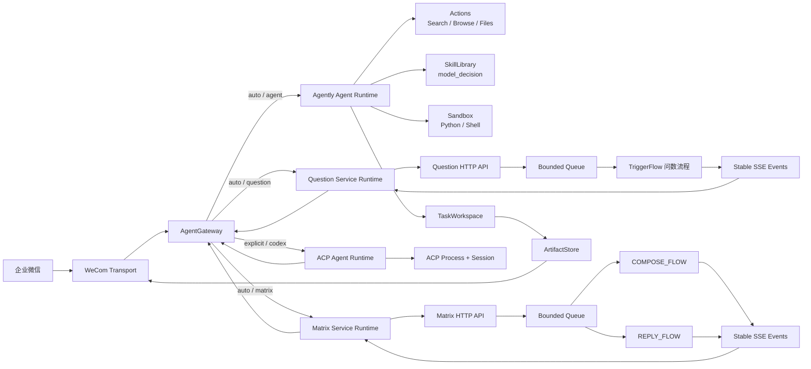

# 综合智能体集成架构

## 一句话设计

系统只有一个统一 `AgentGateway`，它把客户端请求路由到四种执行运行时，并把运行时的过程输出统一为 `GatewayEvent`：

1. **Agently Agent Runtime**：通用 Agent，自主使用 Search、Browse、Skills、Actions、TaskWorkspace 和沙盒。
2. **Question Workflow Runtime**：按固定 TriggerFlow 流程执行的问数服务，通过 HTTP/SSE 对外提供任务服务。
3. **Matrix Workflow Runtime**：社媒矩阵草稿服务。创作与回复是两套 TriggerFlow，产出带评理与降级轨迹的草稿包，P0 不发送。
4. **ACP Agent Runtime**：通过 ACP 连接外部 Codex Agent，并维护独立会话和进程生命周期。

搜索和文档生成是 Agently Agent 的能力，不是独立路由后端。



## 项目边界

```text
integrated_agent/
├── gateway/                 # 统一请求、事件、路由与会话选择
├── runtimes/
│   ├── agent/               # Agently Agent + Actions + Skills + Workspace + Sandbox
│   ├── question/            # 问数任务服务、TriggerFlow 和五阶段分析
│   ├── matrix/              # 社媒矩阵草稿、COMPOSE/REPLY Flow、硬门 Gate
│   └── acp/                 # 外部 ACP Agent 会话
├── storage/                 # 发布后制品存储
├── transports/
│   ├── http/                # 问数与矩阵 HTTP/SSE 入站协议
│   └── wecom/               # 企业微信收发与文件上传
└── bootstrap/               # 两个可部署进程的依赖组装
```

依赖方向固定为：

```text
bootstrap → transports / gateway / runtimes / storage
transports → gateway contracts
gateway → runtime protocol
runtimes → gateway contracts
question analysis → 不依赖 HTTP、企业微信或 Gateway
matrix analysis → 不依赖 HTTP、企业微信、Gateway 或 question.analysis
```

`bootstrap` 可以认识所有模块，但只组装对象；任何业务规则都不能写回启动文件。

## Owner / Invariant Ledger

| Owner | Owns | Completion invariant |
|---|---|---|
| `AgentGateway` | 明确切换、自动路由、会话当前运行时、运行时注册表 | 模型只能返回宿主提供并校验过的 `runtime_key` |
| Intent ModelRequest | 在 `agent`、`question` 与 `matrix` 运行时卡片中做语义选择 | 不允许自动选择 Codex |
| `GatewayRequest` | 文本、会话和附件的客户端无关请求 | 运行时不读取企业微信原始 frame |
| `GatewayEvent` | 文本、状态、图表、证据、制品和终态事件 | Transport 不读取框架私有流事件 |
| Agently Agent Runtime | 通用 Agent 的一次执行与能力挂载 | 搜索、Skills、Actions、Workspace、沙盒在同一个 Agent 所有权内 |
| `SkillLibrary` | Skill 安装、不可变 revision 和资源读取 | 模型只从宿主提供的候选中选择 |
| `AgentExecution` | 当前请求的 Skill 选择、上下文准备和模型执行 | 模型选择后，宿主重新连接并校验 canonical revision |
| `ActionRuntime` | 搜索、文件生成、文件操作、Python 和 Shell 调用证据 | 没有成功 Action 记录就不能声称副作用完成 |
| `TaskWorkspace` | 单任务文件边界、路径 containment、写入和回读事实 | 文件发布前必须取得真实 bytes、size 和 SHA-256 |
| Sandbox | Python / Shell 的隔离执行和命令授权 | 默认要求 Docker，不允许隐式退回不受控本机执行 |
| `ArtifactStore` | 已验证文件的稳定发布副本与不透明 ID | 客户端不能通过下载 URL 访问任意服务器路径 |
| Question HTTP API | 任务受理、状态、SSE、过载拒绝 | 受理任务最终进入 completed 或 failed |
| `QuestionTaskService` | 有界队列、Worker pool、任务状态 | 队列满时立即返回 503 和 Retry-After |
| Question Workflow | 五阶段问数、Evidence、ChartSpec 与 Trace | 最终答案和图表只使用本次运行证据 |
| Question Service Runtime | 把远端 SSE 翻译成 `GatewayEvent` | 消费到稳定终态后结束 |
| Matrix HTTP API | 创作/回复受理、状态、SSE、过载拒绝 | 入口绑定 COMPOSE_FLOW 或 REPLY_FLOW；禁止 auto/mixed |
| `MatrixTaskService` | 有界队列、Worker pool、任务状态 | 队列满时立即返回 503 和 Retry-After |
| ConstraintGate | AC、字数、引用、降级算子 | 硬策略失败不得进入 Review 的 accept 集合 |
| Matrix Service Runtime | 把远端 SSE 翻译成 `GatewayEvent` | `package.ready` 只映射一次 `message.delta` |
| ACP Agent Runtime | 每个 Gateway session 对应一个 ACP client | 不同 IM 会话不共享 ACP session |
| User / token | 注册登录；持久化走 `IdentityRepository`（默认 SQLite）；`admin`/`user` 由 IdentityStore 强制 | 不是 Agently Session，也不是人设 `account_key` |
| WeCom Transport | 企业微信协议、流式快照和原生文件消息 | final 帧只发送一次，制品使用原生文件消息交付 |

## Planned Node Ledger

| Node | Owner | Kind | Input | Output |
|---|---|---|---|---|
| normalize_request | Transport | deterministic | IM frame / HTTP body | `GatewayRequest` / `TaskCreate` |
| explicit_runtime | Gateway | deterministic | `/agent ...` | session runtime |
| classify_runtime | ModelRequest | semantic | text + offered runtime cards | `agent`、`question` 或 `matrix` |
| validate_runtime | Gateway | deterministic | selected key | registered runtime |
| select_skill | AgentExecution | semantic | task + offered Skill cards | selected revision ref or none |
| run_general_agent | AgentExecution | agent loop | text + mounted Actions | reply stream |
| run_document_action | ActionRuntime | side effect | selected Skill + sections | TaskWorkspace file facts |
| run_sandbox_action | ActionRuntime + sandbox | side effect | validated command | bounded Action result |
| publish_artifact | ArtifactStore | deterministic | verified workspace bytes | artifact ID |
| admit_question | HTTP API | deterministic | `TaskCreate` | 202 or 503 |
| execute_question | TriggerFlow | stable workflow | `TaskRequest` | answer + evidence + charts |
| adapt_question_sse | Question runtime | protocol translation | SSE events | `GatewayEvent` |
| admit_matrix | HTTP API | deterministic | `MatrixTaskCreate` | 202 or 503 |
| register_user | host identity + IdentityRepository | deterministic | username + password | user、token；默认写入 `identity.sqlite` |
| execute_compose | COMPOSE_FLOW | stable workflow | compose request | 草稿包 + 评理 |
| execute_reply | REPLY_FLOW | stable workflow | reply request | 评理 + 回复草稿 |
| adapt_matrix_sse | Matrix runtime | protocol translation | SSE events | `GatewayEvent` |
| run_external_agent | ACP runtime | external session | explicit prompt | text deltas |
| present_event | Transport | outlet | `GatewayEvent` | IM stream / file message |

## Planned Edge Ledger

| Source | Value / Event | Consumer | Policy |
|---|---|---|---|
| Transport | `GatewayRequest` | Gateway | 原始平台字段到此为止 |
| Intent model | short `runtime_key` | Gateway registry | 校验并重新连接宿主对象 |
| Gateway | request | selected runtime | Gateway 不解释运行时内部事件 |
| Skill selector | short selection key | SkillLibrary | 校验后解析 canonical revision |
| SkillLibrary | exact revision | AgentExecution | 选择完成后作为可用性契约绑定 |
| AgentExecution | Action call | ActionRuntime | schema、权限与策略校验 |
| ActionRuntime | generated bytes | TaskWorkspace | 先落工作区并完整回读 |
| TaskWorkspace | verified bytes + digest | ArtifactStore | 只发布已验证内容 |
| Question Workflow | stable task event | SSE | 不暴露 TriggerFlow 私有对象 |
| Question SSE | event payload | Question runtime | 翻译成 `GatewayEvent` |
| Matrix Workflow | stable task event | SSE | `package.ready` 只发布一次 |
| Matrix SSE | event payload | Matrix runtime | 翻译成 `GatewayEvent` |
| ACP client | text chunk | ACP runtime | 翻译成 `message.delta` |
| Runtime | `GatewayEvent` | WeCom presenter | 文本、图表提示和文件分别交付 |

## Production-Necessity Ledger

| Element | Why required |
|---|---|
| 运行时级路由 | 路由选择执行模型；搜索、Skills 是 Agent 内部能力，不应伪装成服务 |
| 明确 Codex 切换 | 外部代码 Agent 权限更高，不能由普通业务消息自动进入 |
| Host candidate validation | 模型不拥有服务身份，也不能构造后端对象 |
| Canonical `GatewayEvent` | IM 不依赖 SSE、Agently 或 ACP 的私有事件格式 |
| Native Actions / Skills | 不重复实现 Agently 已拥有的选择、调用和证据机制 |
| Sandbox default | 命令执行必须有独立的隔离和授权边界 |
| TaskWorkspace / ArtifactStore 分离 | 工作文件与对外交付文件具有不同生命周期 |
| Bounded queue | 问数与矩阵模型过载时不能无限占用内存 |
| Stable SSE | Web 和 IM 可以独立消费同一任务事实 |
| Per-session ACP clients | 外部 Agent 的上下文不能跨用户串话 |
| IdentityRepository | 用户注册/token 通过数据库接口落盘；默认 SQLite，不把密码写入 Agently RecordStore；首个用户为 admin，其后公开注册为 user，管理接口按角色鉴权 |
| Thin bootstrap | 入口变化不会迫使业务模块重新组织 |

