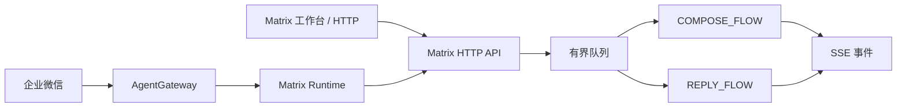

# MatrixCopilot

社媒矩阵内容智能助手：按品牌人设与平台约束生成**多平台推文草稿**与**评论回复草稿**，产出带评理与降级轨迹的草稿包。**P0 不自动发送**，由运营在工作台审阅后外发。

本仓库同时提供统一 `AgentGateway`，可将企业微信等入口路由到矩阵、问数、通用 Agent 与 Codex（显式切换）等运行时。线上主路径为 Matrix 工作台与 HTTP/SSE 任务服务。

## 能力概览

| 能力 | 说明 |
|---|---|
| 推文创作 / 改写 | `COMPOSE_FLOW`：选题情报、素材、多草稿、硬门约束与评理 |
| 评论回复 | `REPLY_FLOW`：评理 → 起草 → 复核；可跳过不宜回复内容 |
| 知识库 | 账号/品牌资料入库、切分与检索，支撑创作与回评 |
| 身份与收藏 | 注册登录、对话会话、收藏夹（SQLite 或 MySQL） |
| 问数（可选） | 企业经营数据问答，独立 TriggerFlow + SSE |
| 企业微信（可选） | 同一 Gateway 入口，`/agent matrix` 等切换运行时 |

## 架构（简图）



创作与回复是两套独立 Flow；入口绑定其一，不做 auto/mixed 混跑。任务经有界队列与 Worker pool，满载返回 503 + Retry-After。

更细的产品与工程说明见 `docs/`。

## 项目结构

```text
.
├── integrated_agent/          # Gateway、各 Runtime、HTTP / 企业微信 Transport
│   └── runtimes/matrix/       # compose / reply / kb_chat / host / rag
├── data/matrix/               # 账号、平台、策略与演示案例
├── docs/                      # 产品与技术方案
├── static/                    # Matrix 工作台与问数前端
├── tests/
├── run_server.py              # 生产 HTTP/SSE 入口
├── run_im_assistant.py        # 企业微信 Gateway（可选）
└── load_test.py               # 队列与背压压测
```

运行时目录 `workspace/`、`logs/` 与密钥不入库。

## 快速开始

### 1. 环境

Python 3.10+：

```bash
python3.10 -m venv .venv
source .venv/bin/activate
python -m pip install -r requirements.txt
```

### 2. 配置

```bash
cp .env.example .env
```

必填：

```text
DEEPSEEK_API_KEY=
```

按需：

| 项 | 用途 |
|---|---|
| `DEEPSEEK_BASE_URL` / `DEEPSEEK_DEFAULT_MODEL` | 模型端点与默认模型 |
| `APP_HOST` / `APP_PORT` | 监听地址（默认 `127.0.0.1:8000`） |
| `IDENTITY_DB=sqlite\|mysql` | 身份库后端 |
| `WECOM_BOT_ID` / `WECOM_BOT_SECRET` | 企业微信 |
| `AGENT_SANDBOX=docker` | 通用 Agent 沙盒（默认 Docker） |
| Embedding 相关变量 | 知识库向量（见 `.env.example`） |

### 3. 身份库迁移

默认 SQLite：`workspace/identity/identity.sqlite`。

```bash
alembic upgrade head
```

MySQL：先建空库（utf8mb4），在 `.env` 设置 `IDENTITY_DB=mysql` 与 `IDENTITY_MYSQL_URL`，再执行同上命令。

### 4. 启动

```bash
python run_server.py
```

| 地址 | 说明 |
|---|---|
| http://127.0.0.1:8000/ | 登录后进入 Matrix 工作台 |
| http://127.0.0.1:8000/matrix | 同上 |
| http://127.0.0.1:8000/question | 问数页面 |
| http://127.0.0.1:8000/health | 存活检查 |
| http://127.0.0.1:8000/ready | 就绪检查 |

启动日志会打印当前生效的 `model` 与 `base_url`（不含密钥），便于核对 `.env` 是否被旧环境变量覆盖。

### 5. 企业微信（可选）

先启动 `run_server.py`，再：

```bash
python run_im_assistant.py
```

切换指令：`/agent auto|agent|question|matrix|codex`。`auto` 仅在 `agent` / `question` / `matrix` 中语义选择；**Codex 必须显式切换**。

## 主要接口

```text
GET  /health
GET  /ready

# 问数
POST /v1/question/tasks
GET  /v1/question/tasks/{task_id}
GET  /v1/question/tasks/{task_id}/events

# 矩阵任务
POST /api/create
POST /api/reply
POST /v1/matrix/tasks
GET  /v1/matrix/tasks/{task_id}
GET  /v1/matrix/tasks/{task_id}/events

# 收藏夹（需登录）
GET|POST   /api/collections
GET|DELETE /api/collections/{id}
POST|DELETE /api/collections/{id}/items[...]

GET  /v1/artifacts/{artifact_id}/{filename}
```

鉴权：Bearer 或 `X-User-Token`。首个注册用户为 `admin`，其后为 `user`。

## 上线检查清单

1. `.env` 中模型密钥与 `base_url` 指向生产可用端点；重启后核对启动日志。
2. `alembic upgrade head` 已在目标库执行。
3. 生产监听：按部署需要调整 `APP_HOST`（容器/反向代理常见为 `0.0.0.0`）与反代 HTTPS。
4. 身份库：生产建议 MySQL；SQLite 仅适合单机试验。
5. 知识库 Embedding 与 Chat 模型密钥分离配置，勿混用。
6. `AGENT_SANDBOX` 生产保持 `docker`；勿对公网开启 `CODEX_AUTO_APPROVE`。
7. `curl /health` 与 `/ready` 通过后再接入流量；可用 `load_test.py` 验证队列背压。

## 验证

```bash
python -m pip install -r requirements-dev.txt
pytest -q
```

## 文档

| 文档 | 内容 |
|---|---|
| [项目方案](docs/MatrixCopilot-项目方案.md) | 产品边界与回评路径 |
| [推文创作技术方案](docs/MatrixCopilot-推文创作技术方案.md) | 写帖 / 改写实现规格 |
| [知识库切分策略](docs/MatrixCopilot-知识库切分策略.md) | 切分与召回 |
| [知识库制品管理](docs/MatrixCopilot-知识库制品管理.md) | 知识库 CRUD / RecordStore |
| [工程方案·技术评审](docs/MatrixCopilot-工程方案-技术评审.md) | 工程评审材料 |

依赖核心：`agently==4.1.4.4`（见 `requirements.txt`）。
