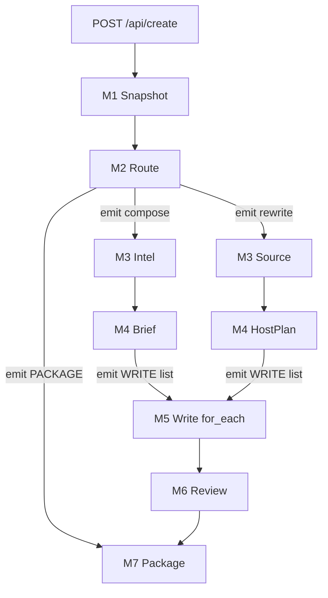
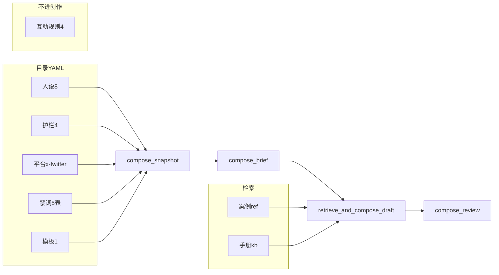

# MatrixCopilot 推文创作技术方案（v1.0 定版副本）

> 2026-08-21 冻结。**§2 M2 分流** 与 **§8.3 会话** 以 [MatrixCopilot-推文创作技术方案.md](./MatrixCopilot-推文创作技术方案.md) 现网实现为准（2026-08-23：M2 用 `route_intent` + `normalize_route_intent`；会话用 `session_id` 作 `activate_session`，非 `task_id`）。其余章节仍作归档参考。

写帖路径（创作 + 改写）的实现规格。产品总案与回评仍以 [MatrixCopilot-项目方案.md](./MatrixCopilot-项目方案.md) 为准；本文覆盖 `COMPOSE_FLOW` 内的分流、图文签发、TikHub 与模块契约。

| 项 | 值 |
|---|---|
| 产品名 | MatrixCopilot |
| Runtime | `matrix` |
| 写帖入口 | `POST /api/create` → `scenario=compose` → 一张 [`COMPOSE_FLOW`](../integrated_agent/runtimes/matrix/compose/flow.py) |
| 回评入口 | `POST /api/reply` → `REPLY_FLOW`（本文不展开） |
| 文档日期 | 2026-08-21 |
| 版本 | **v1.0 定版** |
| 归档状态 | **P0 写帖规格已冻结**。创作/改写落地以本文为准。回评仍以 [MatrixCopilot-项目方案.md](./MatrixCopilot-项目方案.md) 为准 |
| P0 终态 | 过硬门的草稿包。改写带可展示媒体（TikHub `media_url_https`）；创作允许无图。不发送 |
| P0 入站 | **只 HTTP** `/api/create`。本文不考虑企业微信 |

现网骨架：[`compose/flow.py`](../integrated_agent/runtimes/matrix/compose/flow.py) 为 `prelude → brief → for_each(retrieve_and_compose_draft) → review`。落地是把下列模块接到这些工位，并在图上增加一层 `when("compose"|"rewrite")`，不是另起执行链。

### 0. 拍板清单（归档）

| 题 | 拍板 |
|---|---|
| 入口 | 创作与改写共用 `POST /api/create` + 一张 `COMPOSE_FLOW`。不新开 `/api/rewrite` |
| 分流 | 宿主规则为主；仅「一条帖链接 + 主题指令」才 `route_intent`。`force_intent` 纠错 |
| 趋势 | **`need_trends` 前端传参**（默认 false）。true 才打 trending；离开 M3 前宿主可补 1 次 |
| 填参 | search keyword / 对标 handle 归模型 Thought。Confirm 机器校验，无 HITL |
| 改写 | 硬条件只有原文 `source_post`。作者卡、时间线可空 |
| 新鲜 | 保护期 24h。创作只喂期内帖。搜索缺省 `Latest`。用户指定原文过期仍改 |
| 缓存 | 列表 1h；详情/资料 24h。每跳 `TikHub` new + `close()` |
| 图文 | 改写图在 `package.drafts[].media[].preview_url`。创作允许 `media=[]` |
| CTA | 唯一增长行动。渠道 URL ∈ `offered_cta_urls`。P0 不做 SearchWeb |
| 汇合 | `emit("WRITE", work_items)` 进 `for_each`；失败 `emit("PACKAGE")`。改写 `rw1` 同形状 |
| 会话 | 模型 session = `session_id`（HTTP 入参 → `activate_session`）。`task_id` 只追踪本单。P0 不查历史稿、不发送、不考虑企业微信 |
| ReAct | 宿主有界 while；一跳一个 call。创作 ≤8 次 Thought；改写 ≤3 次 HTTP |

P1（明确不做，不算本文遗漏）：工作台「刷新素材」独立入参、跨任务日预算、SearchWeb、按 `source_draft_key` 查库、发送、出图、企业微信 `force_intent`。

---

## 1. 目标与边界

### 1.1 完成不变式

一次写帖受理最终进入 `completed | partial | failed`（现网 `TaskStatus` **必须**含 `failed`，禁止把签发失败映射成 `partial`），产出 **图文草稿包**：

- 每条稿有正文、评理、`degrade_op`。
- **图在包里，不在网页链接预览里。** 改写从 TikHub `data.media` 签发 `source_media`：photo 用 `media_url_https`（jpg）；video 用封面 `media_url_https` + 一条 mp4 `variants`。工作台用这些 URL 直接显示图/视频。P0 不把文档站 URL 塞进正文冒充配图。
- **允许出现、不算失败：** 创作稿 `media=[]`（本号没有配图来源）；改写包内是他人原文媒体（不做人设授权/版权门）；原始 TikHub JSON 不进仓库。
- 正文最多 **一个** 已签发 URL，只用于增长 CTA（官方渠道）。默认 **不要** 把 `pic.x.com` / 媒体 `t.co` 写进正文（X 原帖的 `display_text` 也不含这段）。若运营坚持把媒体占位写进正文，只能用已签发 `pic_tco`，且不能再挂官方渠道。图本身在 package，不占这个名额。
- 硬规则触线被降级；未知 key / 未知 https fail-closed。
- P0 **不**调用渠道发送 API，**不**把媒体文件存进我们的磁盘。工作台/浏览器按 URL 加载预览。P1 若要发成 X 原生附件，再下载 `file_url` 上传，不挡 P0。

过 Gate ≠ 高赞。目标是用图文推文 **引流**（关注系列 / 置顶 / 官方渠道），不是刷评、不是发到 X。

### 1.2 产品约定

- **CTA 是唯一增长行动**：关注本系列后续、点进置顶、去官方渠道（文档 / 等待名单 / 主页）。禁止「你怎么看」「求转」「互关」。
- **多条各自完整**，不是 Thread。
- **新鲜才有意义**：帖有 24h **保护期**。创作热侧只喂期内帖；过期爆款不当对标。用户指定要改的原文即使过期也照改，记 `source_outside_freshness`。
- 同一写帖会话可连续新主题；**每单独立**；上一包不进下一单 Brief。改某一条走改写。
- 创作用人设 `account_key`。互动规则只进回评。

### 1.3 做与不做

| 做 | 不做 |
|---|---|
| 创作与改写共用 `/api/create` + 一张 `COMPOSE_FLOW` | 新增 `/api/rewrite`；客户端传 `scenario=rewrite` |
| 图上 `when("compose"|"rewrite")` 分流 | 绑图前选第二张写帖 Flow；Brief 做 compose\|rewrite 分类 |
| 改写图文用 TikHub 返回的 jpg/mp4 URL 在工作台展示；文案必须改写 | 用网页链接预览冒充配图；流水线出图；把对标媒体写入案例库；评论/粉丝列表进写帖图 |
| 创作无图出包；改写引用原文媒体（含他人图） | 因「没有本号图库」或「版权未清」失败整单或去掉改写配图 |
| 字段以接口响应为准，原始 JSON 不进仓库 | 把计费响应、`cache_url`、明文 key 当夹具提交 |
| TikHub 外挂；列表 1h、详情/资料 24h 缓存，过期后原地覆盖 | DIY 爬 X；通用 Agent Search/Browse 焊进写帖图；缓存在 TaskWorkspace / 知识库 RecordStore / `flow_data`；未命中就连打；拿 TikHub `cache_url` 当数据源；把过保护期的爆款当对标 |
| 仅 handle 无正文/链接 → `failed` | 自动钉赞最高/置顶当原文 |

Transport 现网仍把 `/api/create` 写死为 `scenario=compose`（[`task_api.py`](../integrated_agent/transports/http/matrix/routes/task_api.py)）。改写不另开 HTTP scenario。

---

## 2. 入口与分流

两条获客路径共用一个写帖入口、一张写帖 TriggerFlow。回评仍是现网 `/api/reply` + `REPLY_FLOW`，与写帖分流无关。

分流是图上的边：M2 之后 `when("compose"|"rewrite")` 进入不同的 M3/M4，再汇合到同结构的 M5–M7。**M4 Brief 仍然不分类。** 有 URL 不等于改写。能用宿主规则确定时跳过意图模型。分叉必须 `flow.when(...).to(...)`。

```text
M1 Snapshot → M2 Route
  when compose → M3 Intel → M4 Plan(brief) → M5 Write → M6 Review → M7 Package
  when rewrite → M3 Source → M4 Plan(host卡) → M5 Write → M6 Review → M7 Package
```

### 2.1 `route_intent` 输出

禁止无消费者字段。字段仅此：

| 字段 | 取值 |
|---|---|
| `intent` | `compose` \| `rewrite` |
| `source_kind` | `paste` \| `url` \| `tweet_id` \| `handle` \| `prior_draft` \| `none` |
| `source_anchor` | id / url / handle / 正文起止，或空 |
| `user_instruction` | 去掉原文后剩下的指令，可空 |
| `confidence` | `high` \| `low` |

不得发明未出现的 `tweet_id`。存在 `force_intent` 时本节点不跑。

### 2.2 宿主规则（路由主人）

可机判。候选 = 帖链接/id、handle。**主题指令** = 去掉链接/id/handle 后剩下的非空文本。不靠「像不像推文」的长度或句号猜测。

1. `force_intent` 最高优先。
2. 无候选 → `compose`，不打意图模型。
3. 无帖链接/id → **默认创作**（整段主题也是创作）。只有 `force_intent=rewrite` 才把无 id 文本当原文（`source_unresolved`，无图）。
4. 恰好一条 `/status/{id}` 或显式 `tweet_id`，且没有主题指令 → `rewrite`，不打意图模型。
5. 恰好一条帖链接/id，且还有主题指令 → 才跑 `route_intent`（对标自己写 vs 改口吻）。锚点必须来自候选，不得发明 id。`confidence=low` → 整单 `failed`，请带 `force_intent`。
6. 多条帖链接/id → `failed`，请指定一条。
7. 只给 handle、没有正文或帖链接 → `failed`。不自动钉赞最高/置顶。
8. `intent=rewrite` 且签发成功才进改写支。抽得出 `tweet_id` 则走适配器（详情缓存 24h）。抽不出 id 的改写只改文案。
9. 签发失败 → 同一形状 package、`status=failed`，不滑回创作。
10. 「改这一条」：`force_intent=rewrite` + **本次请求里的稿正文**。P0 不按 `source_draft_key` 查历史。
11. SSE 尽早带上本次 `intent`。P0 HTTP `ComposeHttpIn`：`text`、`account_key`、`need_trends`（默认 `false`）、可选 `post_count` / `force_intent` / `session_id` / `embedding_profile_id`。**是否打趋势由前端传参决定**。`source_kind=prior_draft` 枚举保留，P0 路由不按它查库。不考虑企业微信。工作台「刷新素材」**P1**，P0 无 `force_refresh` 入参。

### 2.3 禁止

- 新增 `/api/rewrite` 或让客户端传 `scenario=rewrite`
- 为改写再 `create_execution` 一张独立写帖 Flow
- 用 `compose_brief` 做 compose|rewrite 分类
- 仅凭正则看到 `x.com` 就改写（「对标结构自己写」仍是创作；只有链接、没有主题指令才走改写）
- handle 自动挑选赞最高/置顶当原文
- 创作 prelude 的 `tweet_card` 冒充 `source_post`
- P0 把 `rewrite_safe` / reflect 画成独立 `when` 却仍塞在一个 chunk 里
- 把回评并进这张图

### 2.4 对照

| 用户输入 | 支路 |
|---|---|
| 「下周发布，写 3 条获客帖」 | 创作 |
| 「对标这条的结构自己写 https://x.com/...」 | 创作（链接进 `tweet_card`） |
| 「把下面改成我们口吻：…」或只贴一条带 `/status/{id}` 的推文 | 改写 |
| 「下周发布写 3 条」且没有帖链接 | 创作（即使很长） |
| 「改成我们的口吻 https://x.com/i/status/…」 | 改写（先拉详情） |
| 「把 @foo 置顶改成我们的」但没贴帖 | `failed`（请给链接或正文） |
| 「看看 @foo 最近怎么写，给我们出一组」 | 创作（handle 进候选；模型 Thought 决定是否拉 profile/时间线） |
| 走错支后带 `force_intent` 再提交 | 按明示走 |
| 「改这一条」 | `force_intent=rewrite` + 本次贴回的稿正文 |

### 2.5 改写硬边界

- 不在本进程 Playwright/HTML 爬 X；只走宿主 **FetchTweets 适配器**（默认 TikHub，可替换）。原始 JSON 不出模型。
- 不把对标媒体当训练语料、不写入案例库/知识库当「已合规」。改写本单可以把该条 `source_media` 放进草稿包给工作台展示，仅限这一单。**P0 不因他人媒体版权拦截、不要求人设授权字段。**
- 正文必须是本号原创表述，不整段抄。改写图文走包内 `preview_url`，不要把文档站 URL 塞进正文冒充配图。创作 P0 **允许无图**（`media=[]`），禁止复制对标 `media_url_https` 来「补本号配图」。都不调用出图服务、不把文件存进我们的磁盘。
- 不新增原文没有、手册/人设也未授权的功效或收益承诺。
- `@` 与标签规则同创作：未授权不 @，标签至多 1 个。
- 互动数字只作排序/选源，不当正文里的「已涨粉 200%」证据。

---

## 3. 模块串 M1–M7

主图是 **模块串**。每个模块内部做完 plan-to-do、有界观察、验收，**收尾一次原子提交**，再交给下一模块。模块之间只传递已提交的 state key，不读半成品。



### 3.0 模块入参 / 出参

state 只在模块 commit 时写入完整对象。下一模块只读已提交 key。`snapshot` 挂在 `runtime_resources`，不进 execution state。

**HTTP `ComposeHttpIn` → 整张图**

| 入参 | 必填 | 说明 |
|---|---|---|
| `text` | 是 | 主题、帖链接、或改写指令+正文 |
| `account_key` | 是 | 人设 |
| `need_trends` | 否，默认 false | 前端传。true 才打 trending |
| `session_id` | 是 | 工作台会话；各 ModelRequest 用同一值 `activate_session(session_id=...)` |
| `post_count` | 否 | 1–10；省略由 Brief 在 `max_posts` 内决定。改写忽略 |
| `force_intent` | 否 | `compose` \| `rewrite` |
| `embedding_profile_id` | 否 | 仅手册检索 |

| 模块 | 所有者 | 读（入参） | 写（出参 / emit） |
|---|---|---|---|
| **M1 Snapshot** | 宿主 | `account_key` | `runtime_resources.snapshot`（人设/护栏/平台/词表/`offered_cta_urls`）。未知人设 → 本单 failed |
| **M2 Route** | 宿主；必要时模型 `route_intent` | `text`、`force_intent`、snapshot | state `intent`、`candidates`（url/tweet_id/handle）。成功 `emit("compose"\|"rewrite")`；只 handle / 多锚点 / 低置信 → `package.status=failed` 并 `emit("PACKAGE")` |
| **M3 Intel** 创作 | 模型 `matrix-compose-intel-react` + Confirm；无 ReAct 时 Search/Browse fallback | `text`、`need_trends`、`user_instruction` | `material_list[]`、`tweet_cards[]`、`trend_cards[]`、`limitations[]`。不写正文 |
| **M3 Source** 改写 | 同上 | `text`、`candidates.tweet_id`（宿主解析） | **必有** `source_post`；`source_media[]`、`author_card`、`related_tweet_cards[]` 可空；`limitations[]`。无原文且无粘贴 → failed + `emit("PACKAGE")` |
| **M4 Brief** 创作 | 模型 `compose_brief` | `text`、snapshot、M3 卡、`post_count` | `brief`：`normalized_brief`、`requirements[]`、`work_items[]`（`WorkItem` 形状）。看不见 `source_post` |
| **M4 HostPlan** 改写 | 宿主，无模型 | `source_post`、`source_media`、`offered_cta_urls`、指令 | `rewrite_plan_card`（`media_choice`、`cta_url`、`source_issues`）+ `work_items=[rw1]`（与创作同形状） |
| **collect** | 宿主 | `work_items[]` | 合法列表 → `emit("WRITE", work_items)`；空/失败 → `emit("PACKAGE")` |
| **M5 Write** | 模型 Draft + 宿主 Retrieve/Gate | **一条** `WorkItem`；snapshot；改写另读 `source_*` + `rewrite_plan_card` | `append` 一条 `GatedDraft`。不调 TikHub |
| **M6 Review** | 模型 `compose_review` | 创作：brief+全部 GatedDraft；改写：另加 `source_post`/`source_media`/`author_card` | 一次替换完整 `drafts[]`；`package_summary`；`limitations[]`。不得回抬 skip/template |
| **M7 Package** | 宿主 | `intent`、`drafts[]`、`limitations[]`、`source_media`（改写） | `package`：`status`、`intent`、`summary`、`limitations`、`drafts[]`（含 `media[]`）。P0 不发送 |

**`route_intent` 出参（仅 M2 在规则不能确定时）**

`intent`、`source_kind`、`source_anchor`、`user_instruction`、`confidence`

**`tikhub_react` 每跳（M3 内部）**

- 入：`text`；info = `need_trends`、候选、已有观察、allowlist、预算、`intent`
- 出：`thought`、`next=call\|stop`；call 则 `method` + `params`

**`WorkItem`（M4 → M5）**

`work_item_id`、`kind=compose_post`、`platform_key=x-twitter`、`requirement_ids`、`goal`、`talking_points`、`claim_types`、`source_comment_key=null`

**`GatedDraft`（M5 → M6 → M7）**

`draft_key`、`kind`、`platform_key`、`degrade_op`、`text`、`rationale`、`decision`、`status`、`issues`、`evidence_ids`、`kb_ids`；改写另经宿主把签发媒体写入包内 `media[]`（`preview_url` 不进 Draft 正文）

---

每个模块的固定收尾：

```text
plan → do/observe（可 DAG）→ reflect/验收 → commit
commit = 宿主 set_state 一次写入完整模块产出
失败则不提交半成品；必要时只提交 failed/limitation 记录
```

P0 不给每个模块再加一个反思模型。Brief / Draft / Review 各至多一次 ModelRequest。**M3 `tikhub_react` 是有界多跳例外**（创作 ≤8 次 Thought，改写 ≤3 次 HTTP）。Gate / Review / 规则验收就是该模块的反思。P1 若加 `draft_reflect`，只放进 M5，仍在该模块 commit 之前。

落地映射到现网 chunk（事件名钉死）：

```text
M1 bind_snapshot（Flow 外）
M2 route
  成功 → set_state(intent) → emit("compose"|"rewrite")
  整单失败（只 handle、多锚点、签发失败）→ set_state(package failed) → emit("PACKAGE")
when("compose") → intel → brief → collect_work_items
when("rewrite") → source → host_plan → collect_work_items
collect_work_items:
  读 state.work_items（list[dict]，与现网 Brief 同形状）
  空或不合法 → 已有 package 则 emit("PACKAGE")；否则 failed package 再 emit("PACKAGE")
  否则 emit("WRITE", work_items)     # 载荷就是 for_each 的列表
when("WRITE").for_each(concurrency=10).to(retrieve_and_compose_draft)
             .end_for_each().to(review).to(package)
when("PACKAGE").to(package)          # 不再 for_each
```

`WRITE` 的 emit 载荷必须是列表，现网 `for_each` 只吃这个。不要靠「两支都 set_state 之后主链自动 join」。失败整单 **不进** `for_each`。图上只保留 compose/rewrite 这一层业务 `when`；`WRITE`/`PACKAGE` 是汇合事件，不是第二套写稿图。`rewrite_safe` 留在 [`drafting.py`](../integrated_agent/runtimes/matrix/host/drafting.py) 内计数。两支 `collect` 写同一形状 `work_items[]`。改写永远 1 条。

### 3.1 M1 Snapshot（宿主）

- Plan：按 `account_key` 解析人设、护栏、词表、模板、280 字。
- Do：`bind_snapshot`（现网在 Flow 启动前，[`snapshots.py`](../integrated_agent/runtimes/matrix/host/snapshots.py)）。
- 反思：未知人设 fail-closed。
- 原子提交：runtime_resource `snapshot` 一次绑定，本单只读。

### 3.2 M2 Route（宿主规则 + 偶尔模型）

- Plan：抽出候选；决定要不要打意图模型。
- Do：见 §2.2。
- 反思：校验枚举、锚点必须来自候选。
- 原子提交：`intent` 卡一次写入并 `emit`；SSE 报支路。可 `force_intent` 整单重跑纠错。

### 3.3 M3 Intel / Source（写稿前材料，不写正文）

**创作 = Intel**：**打不打趋势由请求体 `need_trends` 决定（前端传参）。** 方法怎么调、search 的 keyword 仍由模型 Thought 填（§5.5），机器 Confirm，无 HITL。**P0 不做 SearchWeb**。

- `need_trends=false` 且候选无 URL/handle → **跳过 TikHub ReAct**（0 次 TikHub HTTP）。离开 M3 前宿主 `_ensure_material_media`：先宿主侧 `fetch_search_timeline(search_type=Media)`，仍无 `media_links` 则调 `matrix-compose-intel-task` + Search/Browse fallback（**不是** SearchWeb / `web_card`）。可得到带配图的 `material_list`，Brief 不必空卡。
- `need_trends=false` 但候选有 URL/handle → 进 ReAct 循环，allowlist **不含** `fetch_trending`；finalize 时若推文无配图，同样走 `_ensure_material_media`。
- `need_trends=true` → 进循环，allowlist 含 trending。离开 M3 前若还没打过 trending，宿主补 1 次 `fetch_trending(country=china)`（前端要了热搜，不能被模型 `stop` 掉）。
- 改写 **不看** `need_trends`。

每一跳：模型给出 method+params → 机器 Confirm → `fetch` → 观察后再 thought 或 stop。失败交空卡，照样进 M4。

- **创作禁止**使用 TikHub / 对标帖 `media_url_https` 当本号配图。
- 创作热侧 **只保留保护期内** 的 tweet_card / trend（§5.3）。过期丢弃，空卡照写。
- P0 创作 **允许无图出包**。官方渠道 URL 只来自人设 `offered_cta_urls`。
- 不下载媒体二进制、不落盘。
- 不在这里写 Hook、拆条数。手册和案例检索在 M5。

**改写 = Source**：先解析唯一原文 `tweet_id`，再按 **TikHub ReAct**（§5.5）组装原文包。不在这里写 Hook、拆条数。

解析 `tweet_id`（官方入参只有这一项，示例：`https://x.com/elonmusk/status/1808168603721650364` → `1808168603721650364`）：

- 从 `x.com` / `twitter.com` 的 `/status/{id}` 或 `/i/status/{id}` 抽出数字串，作为 `fetch_tweet_detail(tweet_id=...)` 的唯一入参。
- 多条帖链接 → 整单说明失败或请用户指定，不默取赞最高。
- `t.co` 短链：Twitter-Web **没有**还原接口，记 `source_unresolved`，有粘贴正文则纯文本改写，不把短链当 `tweet_id`。
- 无链接但有 15–20 位纯数字且用户在改写指令里 → 可当 `tweet_id`；详情 404 则回退正文，不整单失败。
- 纯文本、抽不出 id → 文本 `source_post` + `source_unresolved`。Twitter-Web 无法凭空补媒体。
- 只给 handle（`twitter.com/{screen_name}`）→ **失败**。`fetch_user_profile` 只收 `screen_name`/`rest_id`，没有「按 handle 取一条帖」。禁止用 `pinned_tweet_ids_str` 自动钉原文。

有 `tweet_id` 时 **每一跳** 都走 §5.5，**全程自动、无人工确认**：模型根据用户指令和上一跳观察提出 method+params → 宿主机器 Confirm → `fetch` → 观察。禁止跳过确认直接 HTTP。禁止把依赖观察的两跳捏成一批。

改写 Confirm 执法（不是人审，也不是宿主替模型想参）：

1. **硬条件只有原文。** 尚未有 `source_post` 时，只接受 `fetch_tweet_detail(tweet_id=候选)`。模型点了别的方法则本跳自动拒绝并让模型再想一跳；连续两次不改则按该 `tweet_id` 自动执行 detail。
2. 详情成功（或已有可改粘贴正文）→ **可以立刻 `stop` 进 M4**。`author_card` / `related_tweet_cards` **可空**，不挡改写。原文 `posted_at` 超出保护期 **不 failed**，limitation `source_outside_freshness`，照样改文案。
3. 若模型还要打 profile / user_post：观察里有 `rest_id` 则只许传它；两个都传则丢掉 `screen_name`。`protected=true` 后不再接受 `user_post`。
4. **不要**用 `fetch_user_media` 补本条。详情没图记 `source_media_unavailable`。

从链接抽出 `tweet_id` 仍是宿主（确定性解析）。模型不得发明未出现的 id。后续作者接口 XOR：有 `rest_id` 忽略用户名。

相关拉取失败记 limitation，已有 `source_post` 则继续写。详情 `code != 200` 或无 `data`：有粘贴正文则纯文本改写 + limitation；无正文则 `failed`。`sensitive=true`：不入缓存；有粘贴则纯文本改写 + limitation `source_sensitive`；无粘贴则 `failed`。原文正文撞禁词：**不**因此 failed，记 `source_issues`，计划强制非承诺 `claim_types`；草稿仍撞词才 skip。不下载二进制。

评论三条、粉丝/关注/转推列表不进改写。`fetch_user_media` 仅创作可选（判断是否图文号），P0 `cursor=None` 不翻页。

原子提交：创作写入 web/image/tweet/trend 卡；改写一次写入 `source_post`（必有）+ `source_media`（可空）+ `author_card` / `related_tweet_cards`（可空）。

```text
when("compose") prelude
  仅当 need_trends 或候选含 URL/handle → TikHub ReAct
  纯主题且 need_trends=false → 跳过 ReAct；宿主补采配图
  need_trends=true → 离开前必有 1 次 trending
when("rewrite") issue_source_post
  解析 tweet_id 失败 / t.co → 文本 source_post，不进 ReAct
  否则自动 ReAct：第一跳必须拿到原文 detail；之后模型可 stop
  禁止 user_media；禁止仅 handle
```

### 3.4 M4 Plan

**创作**：`compose_brief`（本图唯一的包级计划模型）。拆独立 `work_item`，钉 Hook 角度、一条主张、**唯一增长 CTA**。

**增长 CTA**：每条稿结尾只给一个获客行动。三类合法落点——关注本系列后续、点进置顶、去官方渠道。禁止评论区互动话术。

**一条稿最多一个正文 URL**（媒体不占这个名额）

**渠道链接（CTA）**（现网 `draft_media.resolve_draft_cta` + `draft_gate.gate_compose_draft`）：

- 正文 URL 只认人设 `offered_cta_urls`（P0 无 `web_card`）。
- Brief / Draft instruct：结尾只用**文字 CTA**，**不要求**模型写 `[[cta:0]]` 或手写 https。
- Gate 内可含 `[[cta:N]]`（下标校验、按 23 计字）；**出包前**展开为 `offered_cta_urls[N]`，`package.drafts[].text` 不得仍含 `[[cta:…]]`。
- 媒体：`[[media:m*]]` 出包进 `draft.media[]`。不要用网页预览冒充配图。
- 改写：`[[media:m1]]` 在包里；正文链接仍只认 `offered_cta_urls`。

**改写 P0**：宿主拼 `rewrite_plan_card`（state 里），**再收成一条与创作同形状的 `WorkItem`**，供 `for_each` 使用。不单开 rewrite_plan 模型，**不改 WorkItem 字段表**。

`rewrite_plan_card`（仅 state，Draft 可读）：`media_choice`、`cta_url`（空或 ∈ offered_cta_urls）、`source_issues`。

有 `source_media` 时 `media_choice` 默认 `reuse_source_media`，**多图取 `photo[]` 数组第一张**（其余丢弃 + limitation `media_truncated`）；视频取 `variants` 中 `content_type=video/mp4` 且 `bitrate` 最高的一条（不要 m3u8）。`official_cta_link` 仅当 `offered_cta_urls` 非空且用户指令明确要带渠道。缺省 `[]` 则只能 `reuse` 或 `none`。

宿主收成的那一条 `WorkItem`：

| 字段 | 值 |
|---|---|
| `work_item_id` | `rw1` |
| `kind` | `compose_post` |
| `platform_key` | `x-twitter` |
| `requirement_ids` | `["r1"]` |
| `goal` | 指令非空用指令，否则「改写成此人设口吻，保留可核验事实，结尾一个增长 CTA」 |
| `talking_points` | 从 `display_text` 截 ≤3 条短句（宿主截断，不另开模型） |
| `claim_types` | 有 `source_issues` 则只有 `format`；否则 `["format"]` |
| `source_comment_key` | `null` |

M5 仍吃 `WorkItem`；改写额外读 `state.intent` + `rewrite_plan_card` + `source_media`。

`reuse` 与官方渠道不再为「唯一 URL」互斥：图在包里，渠道在正文。改写后的 CTA 仍必须是增长行动，不能抄对标的求转。

- DAG：work_item 彼此无边，只是计划清单。
- 反思：id 唯一、条数、`claim_types` ⊆ offered、无评论 key。
- 原子提交：创作 `set_state("brief")`（含 `work_items`）；改写 `set_state("rewrite_plan_card")` + `set_state("work_items")` 长度 1。Draft 不得改主张类型。

### 3.5 M5 Write（现网一条 chunk，条级 DAG）

- Plan：吃本条 work_item / 改写计划卡。
- ReAct：检索案例+手册（观察）→ Draft（行动）→ Gate（观察）→ 至多一次 `rewrite_safe`。写稿不调 TikHub，不发明未签发 https，不把 CDN 写进正文。
- DAG：`for_each` 多条并行（现网 concurrency=10，与 `max_posts=10` 对齐）。
- 反思：Gate 扫禁词、增长话术、标签数、字数（Gate 内 `[[cta:]]` 按 23、剥 `[[media:]]`）、未知 https、近重复等（同主规格 §3.5）。
- 原子提交：Gate 后 `resolve_draft_cta` / `resolve_draft_media`，再 append `GatedDraft`。
- 出包 `text` 不含 `[[cta:…]]`；媒体进 `media[]`。

顺序已经在 [`drafting.py`](../integrated_agent/runtimes/matrix/host/drafting.py)，P0 **保持这一条 chunk**：

1. RetrieveCases：query = platform + claim_types + goal → `hits|empty|failed`
2. RetrieveKb：query = goal + talking_points；失败不 skip
3. compose_draft：优先文字 CTA；Gate 内可含占位符
4. ConstraintGate
5. resolve_draft_cta + resolve_draft_media
6. 收尾原子提交

P1 若加 `draft_reflect`，放在步骤 3 与 4 之间，仍在本模块 commit 之前。案例 `failed` → 该项 skip。手册失败 → 继续写。空案例且主张需要引用 → 降级，禁止编 `e1`。

### 3.6 M6 Review（包级反思）

**compose_review**

- 看见：brief + 全部已 Gate 草稿 + limitations
- 对齐：同一人设下系列帖口径（今日）/ 矩阵口径（多平台之后）
- 不得回抬 skip / `template_fallback`；revise 再过该稿平台 Gate

**rewrite_review**（同工位、改写支）

- 看见：`source_post` + `source_media`（可空）+ `author_card`（可空）+ 已 Gate 草稿
- 文案须相对原文明显改写（近重复阈值同 M5：连续 ≥40 字则硬伤，走一次 revise）
- 媒体只许本单已签发 `[[media:]]`；官方渠道只许 `offered_cta_urls` 已签发下标。二者可同时出现（图在包里、渠道在正文）。不得引用 `related_tweet_cards` 的媒体
- 不得回抬 skip / `template_fallback`

原子提交：一次替换完整 `drafts`。验收包内媒体字段能否展示，不把网页预览当图。

### 3.7 M7 Package

- Do：拼 §7.6 形状的 SSE 包。每条稿带 `media[]`（改写：已选那一张的 `kind`/`preview_url`；创作 `[]`）。
- 原子提交：一次写入 `package`。P0 不发送、不落盘。**P0 验收只要求工作台能显示 `preview_url`**。P1 再下载 `file_url` 上传。

### 3.8 策略在模块里怎么用

不是再叠一层全球循环。

- **Plan-to-do**：每个模块先有产出清单，再干活。创作的包级计划只在 M4；M5 只执行该条计划。
- **ReAct**：M3 TikHub 走 §5.5，**模型填参、机器 Confirm、无人审**。M5 仍是检索 → Draft → Gate。Twitter-Web 不挂进可连打的 Action 列表。禁止 `pause_for` 等人批工具。`for_each` 内禁止调 TikHub。
- **DAG**：P0 的 M3 TikHub **一律串行**（一跳一个 call）。并行只出现在 M5 `for_each` 多条稿。模块与模块之间仍是串行。
- **反思改进**：模块收尾的宿主验收，或 M6 Review。P0 不加条级反思模型。
- **原子操作**：只发生在模块最后一步 `set_state` / 合法 `append` 完整项。禁止边算边把半截正文、半截卡片写进下一模块能读到的 key。

功效路径仍须补案例夹具，否则 M5 观察为空，模块完整也写不出承诺稿。

---

## 4. 图文与 CTA

对照真实返回（`fetch_tweet_detail` / `fetch_user_media` / `fetch_user_post_tweet` / `fetch_search_timeline`）：

- 图：`data.media.photo[].media_url_https` → `https://pbs.twimg.com/media/….jpg`
- 视频：`data.media.video[].media_url_https` 是 **封面 jpg**；可播文件在 `variants[]` 里 `content_type=video/mp4` 的 `url`（不要用 m3u8 当 P0 预览）
- 原文 `text` 末尾常带 `https://t.co/…`，`display_text` 没有这段；`entities.media[].display_url` 为 `pic.x.com/…`。这是 X 原生媒体占位，不是文档站链接卡。

**P0 图文 = 工作台展示这些 jpg（视频再加封面），媒体走 package 字段，不是把任意 https 写进正文靠链接预览。**

```text
改写：M3 fetch_tweet_detail.data.media → source_media
      工作台： 或视频封面
      正文：改写 display_text，默认不把 t.co 写进稿
      可选：正文只跟一张已签发的 pic.x.com/t.co（占 23 字）或一张官方渠道，二选一
创作：P0 允许无图。不复制对标 media_url_https
```

`source_media` 投影。对照 `fetch_tweet_detail`（例 `tweet_id=1808168603721650364`）：`data.media.photo[0].media_url_https` = jpg；`entities.media[0].url` = `https://t.co/…`，`display_url` = `pic.x.com/…`，`entities.urls` 为空。搜索/发帖时间线的视频：`data.media.video[].media_url_https` 是封面 jpg，`variants[]` 含 `video/mp4`（带 `bitrate`）和 m3u8。

模型热侧只给 key / kind / 宽高，**不给 CDN URL**（防止写进 280 字）。工作台和 SSE 包给 URL：

| 字段 | 谁看见 | 来源 |
|---|---|---|
| `media_key` | 模型 + 包 | `m1`… |
| `kind` | 模型 + 包 | `data.media` 的键：`photo` 或 `video` |
| `width` / `height` | 模型 + 包 | `original_info` 或 `entities.media[].original_info` |
| `preview_url` | **仅包 / 工作台** | `media_url_https`（图=原图 jpg，视频=封面 jpg） |
| `file_url` | **仅包，P1 上传** | photo 同 preview；video = mp4 variants 中 bitrate 最高 |
| `pic_tco` | 冷侧；仅当正文选择媒体占位 | `entities.media[].url` |
| `duration_ms` | 包，视频 | `video.duration`（实测为毫秒） |

| 规则 | 约定 |
|---|---|
| 改写有图 | 包内 `media[]` 必须带 `preview_url`。工作台用 `` / 封面显示。正文默认零媒体链 |
| 改写无 `data.media` | 无图照写，`source_media_unavailable` |
| 创作 | 允许 `media=[]`。禁止把搜索/对标时间线的 `media_url_https` 当本号配图 |
| skip/模板 | 不带媒体、不带外链 |
| 出图 | 不做 GenerateImage |
| 版权 | P0 改写引用原文媒体是允许的完成物，不做人设授权门、不因此降级 |
| 真发到 X | P1 用 `file_url` 上传为原生附件；P0 不发送、不落盘 |

CTA 与正文 URL：

- 有 `source_media` 且 CTA 是关注/置顶 → 正文可以零 URL，图在包里。
- CTA 是官方渠道 → 正文那一个 URL 必须是渠道；图仍在包里，不要再写 `pic.x.com`。
- 仅当要把媒体占位写进正文（少见）→ 只用已签发 `pic_tco`，按 23 字计，且不能再挂官方渠道。

---

## 5. 联网与 TikHub

「从网上搜需要的元素」和「对接第三方拉推文」都是 **新观察**，必须先校验成短卡，再进 Brief/Draft。TikHub ReAct 不把 Search/Browse 挂进模型 Action；Intel 无配图时宿主 deterministic 调 Search/Browse fallback（不签发 `web_card`）。TikHub **不是**活的 ExecutionResource：每一跳 Act 自己建客户端、用完 `close()`。

### 5.1 两套能力、两套卡片

**SearchWeb**：**P0 不做。** 不调通用 Search、不签发 `web_card`。官方渠道只认人设 `offered_cta_urls`。P1 若做，再加 `allowed_link_hosts`。

**FetchTweets（第一家：TikHub）**：只通过宿主适配器调用。**每一跳 HTTP 新建** `TikHub(api_key=…)`，`finally: close()`。禁止把开着的 SDK 挂进 ExecutionResource / `runtime_resources`，禁止跨跳复用未 close 的 client。缓存命中不建客户端。成功响应落在 **独立 RecordStore**（§5.4，按方法 TTL）。密钥只读环境变量 `TIKHUB_API_KEY`，禁止写进仓库。**禁止** Flow / 模型 / `for_each` 直打 SDK。每次真实 HTTP 计费，适配器先查未过期记录，命中则 0 次 HTTP。`TikHubPermissionError` → limitation `tikhub_permission`，继续写。投影 `tweet_card`：`tweet_key`（t1…）、handle、text（截断）、like/repost/reply、has_media、`posted_at`、`as_of`。原始响应不出模型。

宿主验收：条数封顶（tweet≤8）；超时/4xx/空结果 → 对应 limitation，**继续写**，不失败整单。未知 key fail-closed。

**谁填参：** **打不打 `fetch_trending` 由前端 `need_trends` 决定。** search 的 keyword、要对标的 handle 仍由 **模型 Thought** 提出。宿主 Confirm 是机器校验，不弹窗。不覆盖模型已给出的合法 keyword。`need_trends=false` 时模型点了 trending → 本跳拒绝。

Confirm 自动补全 / 拒绝：

- 省略 `country` → `china`；P0 显式非 china → 本跳拒绝
- **省略 `search_type` → `Latest`**（保护期内才有意义；不用 OpenAPI/`Top` 当缺省）
- `keyword` 由模型出；空或全是链接 → 本跳拒绝，观察里说明，模型可自动再想一跳
- `screen_name` / `tweet_id` 必须 ∈ 候选或上一跳观察。发明的 id/handle → 拒绝，不 HTTP
- `rest_id` XOR `screen_name`；两个都传且观察有 rest_id → 丢掉 screen_name

对标形态：只借鉴结构。创作 tweet_card 的 `media_url_https` 不得当本号配图。P0 不搜网页。

TikHub Twitter-Web 入参以 [OpenAPI](https://api.tikhub.io/#/Twitter-Web-API) 为准（2026-08-20 扫描）。方法名 = `/api/v1/twitter/web/` 最后一段。全部 GET query。**没有**帖 URL、没有 `t.co` 还原、没有按关键字查单帖。

| 方法 | 入参 | 改写用法 |
|---|---|---|
| `fetch_tweet_detail` | **`tweet_id`** string 必填 | 原文唯一入口。从 `https://x.com/{user}/status/{id}` 取 id |
| `fetch_user_profile` | `screen_name` 与 `rest_id` **二选一**（有 rest_id 则忽略用户名） | 详情后拉作者。无 cursor |
| `fetch_user_post_tweet` | `screen_name` / `rest_id` 二选一；`cursor` 翻页 | 第一页 `cursor=None`，时间线原序当 related。有 rest_id 只传 rest_id |
| `fetch_user_media` | `screen_name` 必填（文档：与 rest_id 二选一）；`cursor`←`next_cursor` | **创作可选**。不能按 tweet_id 查，**禁止**用来补原文图 |
| `fetch_search_timeline` | **`keyword`** 必填；产品缺省 **`Latest`**；可选 `Top`/`Media`/`People`/`Lists`；`cursor` | 只创作。P0 不用 People/Lists |
| `fetch_trending` | 产品省略 = `china`（不是 OpenAPI `UnitedStates`）。casefold 进缓存键 | 只创作 |
| `fetch_post_comments` / `fetch_latest_post_comments` | **`tweet_id`**；`cursor` | 只回评 |
| `fetch_user_tweet_replies` | **`screen_name`**；`cursor` | 只回评 |
| `fetch_user_followings` / `fetch_user_followers` | **`screen_name`**；`cursor` | 不用 |
| `fetch_retweet_user_list` | **`tweet_id`**；`cursor` | 不用 |

P0 所有列表 `cursor=None`，不按 `next_cursor` 翻页。改写单任务：有 `tweet_id` 则必打 detail；profile / user_post 可选。

| 方法 | 创作 | 改写 | 回评 |
|---|---|---|---|
| `fetch_tweet_detail` | 对标单帖可选；须在保护期内才进热侧 | **原文必调**（有合法 tweet_id）；过期仍改，记 limitation | 不用 |
| `fetch_user_profile` | 对标号可选 | 可选 | 不用 |
| `fetch_user_post_tweet` | 对标时间线可选；热侧滤保护期 | 可选；related 可空 | 不用 |
| `fetch_user_media` | 判断是否图文号 | **不调** | 不用 |
| `fetch_search_timeline` | `keyword` + 缺省 `Latest` | 不调 | 不用 |
| `fetch_trending` | `country=china`；HTTP TTL 1h | 不调 | 不用 |
| 评论三条 | 不调 | 不调 | 用 |
| 粉丝/关注/转推列表 | 不用 | 不用 | 不用 |

适配器可替换，默认实现钉 TikHub。禁止把 TikHub JSON 当案例 RAG；禁止 DIY 爬虫节点。`tikhub` 尚未进入 `requirements.txt`；套餐须含 Twitter-Web。

### 5.2 调用形态

适配器内部、**仅缓存未命中**时才允许这段 SDK 调用。每跳一次，用完必须 `close()`：

```text
from tikhub import TikHub
from tikhub._errors import TikHubPermissionError

client = TikHub(api_key=os.environ["TIKHUB_API_KEY"])
try:
    resp = client.twitter_web.<method>(...)
    # resp["code"] == 200 才读 resp["data"]
finally:
    client.close()
```

禁止：跨跳把 `client` 留在适配器实例上；`runtime_resources` 挂 `TikHub` 对象；ExecutionResource 当活连接。缓存命中：不 new、不 close、http=0。

每次真实 HTTP 计费。信封结构一致：成功 `code=200`，含 `router`、`params`、`data`、`time_stamp`、`request_id`。失败不要假设一定有 `data`。`cache_url` 只给 trace，**不会经 API 再返回数据，禁止当二次数据源、禁止用它免费用第二次**。

业务代码只调适配器 `fetch(method, **params)`。适配器内部：规范化入参 → RecordStore 精确查键（宿主算 TTL）→ 未命中才 `client.twitter_web.<method>(...)` → 成功则原地覆盖写入。

字段以 2026-08-20 六份 Twitter-Web 成功响应为准：`fetch_tweet_detail`、`fetch_user_profile`、`fetch_user_post_tweet`、`fetch_user_media`、`fetch_search_timeline`、`fetch_trending`。不要把这些原始 JSON 提交进仓库。

### 5.3 方法与投影

**`fetch_trending(country=...)`** → `trend_card`（不是 tweet_card）

- 入参：`country` 可选。**产品省略 = `china`**，再 casefold 进缓存键。禁止把 OpenAPI `UnitedStates` 当省略默认。实测 `china` 200；`China` 与 `china` 同一键。
- HTTP TTL **1h**（热榜在保护期内会变）。
- `data.trends[]`：`name`、`context`、`description`（常 null）
- 热侧只给 top-N 的 `trend_key`、`name`、`context`；不把整表趋势灌进 Prompt
- Brief 只许选用和本次主题相关的，禁止为蹭热度改人设

**`fetch_search_timeline(keyword=..., search_type="Latest")`** → `tweet_card`

- 入参：`keyword` 必填；**产品缺省 `Latest`**（保护期内时间序）。文档另有 `Top`/`Media`/`People`/`Lists`；P0 不用 People/Lists。模型写 `Top` 仍接受，但热侧仍滤保护期（老爆款会被丢掉）
- `cursor` 有则来自上次 `next_cursor`；P0 不传
- `data.timeline[]`，只保留 `type=="tweet"`
- 赞：`favorites`；正文：`text`（可先按 `display_text_range` 再截断到 ≤280）
- 媒体：热侧只留 `has_media`

**`fetch_user_profile(screen_name=..., rest_id=...)`** → 对标号卡 / 改写 `author_card`

- 入参二选一：`screen_name`（如 `elonmusk`，来自主页 URL）或 `rest_id`（整数，如 `44196397`）。有 rest_id 则忽略用户名
- 改写：可选。有 rest_id 优先只传 rest_id
- 热侧：`handle`←`profile`，`display_name`←`name`，`bio`←`desc`（截断），`followers`←`sub_count`，`media_count`，`protected`
- `protected=true` 则不再打发帖接口（这是锁推，不是保护期）
- `pinned_tweet_ids_str[0]` **不得**因只有 handle 就自动当原文
- 冷侧：`rest_id`、avatar/header URL

**`fetch_user_post_tweet(screen_name=..., rest_id=...)`** → `tweet_card` / 改写 `related_tweet_cards`

- 入参：`screen_name` / `rest_id` 二选一；`cursor` 翻页。改写有 rest_id 只传 rest_id，`cursor=None`
- 改写：可选。时间线 **原序** 截 ≤5，禁止按 `favorites` 重排。只借鉴结构，媒体不得进改写正文
- `data.pinned` + `data.timeline[]`；P0 不翻页。创作热侧丢掉超出保护期的项（置顶若过期也丢掉，不当「最新」）
- 赞字段是 `favorites`；`media` 可能是 `[]` 或带 photo/video 的对象

**`fetch_tweet_detail`** → 改写源 `source_post` + `source_media`

- 入参只有 **`tweet_id`**（string）。官方从帖链接 `/status/{id}` 截取
- 改写在已解析合法 id 时必调；本条媒体只信这份响应的 `data.media` 与 `entities.media`
- 热侧正文优先 `display_text`（不含媒体 t.co）；`text` 含 t.co 只作冷侧对照
- `source_media`：见 §4。模型热侧只有 `m*` + `kind` + 尺寸；`preview_url` / `file_url` 进包，不进 Draft Prompt
- 作者 `screen_name` / `rest_id` 留给下一步 profile
- 多图时 **只签发 `photo[]` 第一张**（数组序），其余 `media_truncated`
- 视频 `file_url`：`variants` 中 `content_type=video/mp4` 且 `bitrate` 数值最高的一条；不要 m3u8；不要按宽度猜
- `sensitive=true`：有粘贴则纯文本改写；无粘贴则 `failed`
- 不下载、不落盘

**`fetch_user_media`**

- 入参：`screen_name`（OpenAPI required）与 `rest_id` 文档为二选一；`cursor`←`next_cursor`
- 创作：可选，第一页判断是否图文号
- 改写：**不调**。不能按 tweet_id 定位，翻页找本条无上界
- 不下载 `media_url_https`

出帖/搜索统一 `tweet_card`：

- `tweet_id` ← `tweet_id` 或 `data.id`
- `handle` ← `author.screen_name` 或搜索结果的 `user_info.screen_name` / 顶层 `screen_name`；再空则用 `params.screen_name`
- `text` ← 优先 `display_text`；否则 `text`。热侧截断建议 ≤280
- `favorites` ← `favorites` 或 `likes`
- `views` 为字符串，转 int，失败当 0
- `has_media` / `media_kind`：创作 tweet_card 热侧只留布尔和种类，**不给 URL**。改写 `source_media` 另发卡，见 §4
- `sensitive=true` 丢弃；搜索项 `type != "tweet"` 丢弃
- `quoted` 只抽一层短摘要
- `as_of` ← 信封 `time_stamp`（拉取时刻，不是发帖时刻）
- `posted_at` ← 帖 `created_at` / 等价时间字段；没有则用 `tweet_id` snowflake 解毫秒；仍解不出 → **创作热侧丢弃该条**（不猜）

**保护期（新鲜硬门）**

X 上帖的有效观察窗口是发布后 **24 小时**（`now - posted_at < 24h`）。过了窗口还当「正在发生」会把老爆款写成今日口径。

- **创作** tweet_card：只签发保护期内的。滤完为空 → 空卡 + `intel_stale`，照写。
- **创作排序**：先按 `posted_at` 新→旧，窗口内再可按 `favorites`。**禁止**先按赞把三年前爆款排上来。封顶 8。
- **trend_card**：本身不是帖；靠 1h HTTP TTL 保证「此刻热搜」，不按 posted_at 滤。
- **改写原文**：用户指定的 `tweet_id` **不因过期拒绝**。过期记 `source_outside_freshness`，仍出改写稿。related 若拉了，创作同规则可滤保护期；全过期则 related 空。
- 不是账号 `protected`（锁推）。锁推仍按 `protected=true` 停 user_post。

搜索里常见求转/恐吓长文，Draft **不得**抄其 CTA 或整段论述，只借鉴结构。改写 `related_tweet_cards` 保持接口时间线原序，不按赞重排。

冷侧：`request_id`、`cache_url`、媒体 URL、`rest_id`、完整 JSON。不把文件存进我们的磁盘。创作支的 `media_url_https` 不得当本号配图。改写支经 `source_media` 签发后：模型写 `[[media:]]`，工作台用 `preview_url` 显示。

### 5.4 外挂 + RecordStore 缓存（计费硬门）

TikHub **按次计费**。他们信封里的 24h `cache_url` 只供溯源，**不会再从 API 返回正文**，不能拿来省钱。

**相同 API 方法 + 相同规范化入参，在该方法 TTL 内最多 1 次真实 HTTP。**

TTL 按方法（读时比较 `fetched_at`）：

| 方法 | TTL | 原因 |
|---|---|---|
| `fetch_trending` / `fetch_search_timeline` / `fetch_user_post_tweet` / `fetch_user_media` | **1h** | 保护期内排行和「最新」会变 |
| `fetch_tweet_detail` / `fetch_user_profile` | **24h** | 同一帖正文、资料相对稳 |

列表命中 1h 缓存后，投影仍要再滤保护期（缓存里可能混进已过期帖）。

这是宿主确定性工作，不把 `twitter_web.*` 注册成模型可调 Action，不走通用 Search/Browse。调用形态是 §5.5 ReAct：模型或剧本只提出 method+params，宿主确认后才 `fetch`。

**Agently owner**

| 层 | 管什么 |
|---|---|
| ExecutionResource | **不挂** TikHub SDK。SDK 每跳新建、`finally close()` |
| 独立 RecordStore | 跨任务成功 `data`。构造必须 `LocalRecordStore(workspace/tikhub)` 再交给 `RecordStore`（禁止 `RecordStore(路径)` 套成 `.agently/records`）。`indexed=False`、`vector=False`。与知识库 `records.db` 分开。目录 gitignore |
| 宿主 | 适配器 `fetch`、`cache_key` 规范化、TTL 算术、预算、投影短卡、未知方法 fail-closed |
| TriggerFlow state | **仅本单**投影卡。`runtime_resources` 只挂适配器与 RecordStore 句柄，**禁止**挂开着的 `TikHub` |
| TaskWorkspace | **不用**。那是单任务文件空间，默认跟任务走，没有 TTL/精确键/跨单共享；禁止在里面藏 json 当库 |
| `flow_data` | **不用**。跨 execution 且非并发安全 |

知识库那份 RecordStore 带 embedding 和 `retrieve(query=…)`，禁止当计费缓存。命中必须用 `search(filters=…)` + `get(ref)`，与知识库按 `scope.doc_id` 精确找文档同一套，**禁止** `retrieve("Elon Musk")` 近似命中。

定位：辅助写稿。没额度、只命中缓存、或模型 `stop` 时，照样出草稿。创作、改写、回评、多任务、多人设共用这一层。`for_each` 里禁止调 TikHub。

**缓存身份** `cache_key = method + canonical(params)`

1. `method`：Twitter-Web 最后一段，如 `fetch_tweet_detail`。
2. 丢掉 `None`、空字符串、未传的可选字段。
3. 填 **产品默认** 后再哈希，不是 OpenAPI 默认：`search_type` 缺省=`Latest`；`country` 缺省=`china`（实测 200；与 `China` casefold 同一键）。省略 country 不得填 `UnitedStates`。
4. `country`、`screen_name` casefold；`keyword` 只 trim、空白折叠；`tweet_id` / `rest_id` 当字符串。
5. 有 `rest_id` 则键里不含 `screen_name`。
6. `cursor=None` 不进键。带 cursor 视为不同键。
7. 键与 `account_key` / `task_id` / `session_id` **无关**。

记录形状：`collection=tikhub`，`kind=method`，`scope.cache_key=…`。正文为成功 `data` + `fetched_at` + `request_id`。不存媒体二进制，不把计费信封提交进 git。

**TTL 与覆盖**

RecordStore **不会自己到期删除**。`fetched_at` 用宿主 Unix 秒，不用信封 `time_stamp`（时区是洛杉矶）。满不满该方法 TTL 读时比较。过期条目仍在库里，只是 miss。

同一 `cache_key` 只许一条活记录。`search` 之后：

- 0 条 → 稍后 `put`
- 1 条且未过期 → 命中
- 1 条且过期 → miss，HTTP 成功则对这条 `RecordRef` 改正文（`backend.put_record` 或等价覆盖）
- N>1 条 → 留下 `fetched_at` 最新的一条，其余删除，再按 1 条处理

禁止只 `put` 不覆盖。进程内锁从「判定 miss」到「写入结束」一直持有，避免双 HTTP。

`sensitive=true` **不写入**成功缓存。失败（5xx/超时/权限）不覆盖旧成功记录；短冷却只放进程内存，重启多打一次可接受。

**读路径**

```text
fetch(method, params):
  key = canonicalize(method, params)
  进程内同键单飞（P0 四个 asyncio worker 共用一把锁）
  search(collection=tikhub, kind=method, scope.cache_key=key)
  若命中且 now - fetched_at < 该方法 TTL → 投影短卡写入本单 state，http=0
  若处于失败短冷却 → 仍有效的旧成功记录，否则空卡 + limitation，http=0
  否则 本跳 new TikHub → 打 1 次 HTTP → finally close()
    code=200 且有 data → 无记录则 put；有记录则原地覆盖。TTL 从本次 fetched_at 起算（按方法 1h 或 24h）
    否则不覆盖成功记录，进入失败短冷却；仍须 close()
```

**何时才允许发起真实 HTTP**（在缓存未命中或已过期之后）

改写只要解析到 `tweet_id`，**即允许**走适配器。每条接口仍先 `fetch`（命中则 http=0）。创作的 `fetch_trending` **只看** `need_trends`（前端传参）。search / 对标仍由模型在循环内填参。

- `TikHubPermissionError`：limitation；有粘贴正文则纯文本改写；无正文则 `failed`（说明套餐）
- 详情 4xx/无 data：有粘贴则纯文本改写；无正文则 `failed`
- 抽不出 id 的纯文本改写 **不调** Twitter-Web
- 只给 handle 的改写不打时间线自动钉帖

创作 prelude：ReAct 仅当 `need_trends=true` 或候选含 URL/handle；纯主题且 `need_trends=false` → 跳过 ReAct，宿主补采配图（0 次 TikHub HTTP）。

**强制刷新（P1）**：工作台「刷新素材」可绕过该方法 TTL，同一键 ≥10 分钟冷却。P0 无此入参。

**预算**（只计真实 HTTP，命中缓存不计）

- 创作单任务：最多 1 trending + 1 search + 每个对标 handle 1 次资料/发帖（缓存命中则该项为 0）
- 改写单任务：**必打**至多 1 次 `tweet_detail`（拿到原文即可停）。profile / user_post 可选，各至多 1 次。不用 `user_media`
- **P0 不做跨任务日上限**（身份和存储未定义）。打满单任务预算则只用缓存或空卡；改写详情既无有效缓存、请求失败、且无粘贴正文才 `failed`

P0 单飞用进程内锁即可。RecordStore lease 本仓库尚未使用；多进程再补，在此之前多 worker 必须共用同一 RecordStore 根目录。

```text
rewrite source pack  — 原文够用即可 stop
  resolve tweet_id from /status/{id}     # 宿主解析
  if none or t.co → 文本 source_post + source_unresolved
  else:
    Confirm 第一跳必须 detail(tweet_id)
    有 source_post 后模型可 stop
    若继续：profile / user_post 用观察里的 rest_id
  不调 user_media
```

```text
prelude  — 趋势门闩=前端 need_trends；keyword 仍模型填
  if not (need_trends or candidates_url_or_handle) → 空卡
  loop (预算内):
    模型 thought + {method, params} 或 stop
    stop / 预算尽 → 若 need_trends 且本单还没 trending → 宿主补打 1 次 → 退出
    Confirm 失败 → 观察说明原因，模型自动再想（每跳最多 1 次重提）
    Confirm 通过 → fetch → observe → 下一跳
  → Brief（有卡用卡，无卡照写）
```

### 5.5 TikHub ReAct（工具调用协议）

用户提交之后 **全程自动**：模型自己判断调哪个方法、传什么参。没有人工点确认、没有 HITL 暂停。宿主 Confirm 是代码校验，当场通过或拒绝。

每一跳必须按顺序走完，禁止「想都没想就打」或「确认失败仍 HTTP」。

```text
Thought  →  Confirm  →  Act  →  Observe
模型想怎么调  机器校验参数   执行     观察后再想下一跳或 stop
```

| 步 | Owner | 做什么 |
|---|---|---|
| Thought | **模型**（创作/改写同一协议） | 看见用户原文、候选、已有观察、预算。输出 `thought` + `next=call\|stop` + `method` + `params`（含 keyword）。不得发明候选/观察里没有的 id/handle |
| Confirm | **宿主代码，无人** | OpenAPI、产品缺省、XOR、预算、锚点 ∈ 候选或上一跳观察。不通过 → 不 HTTP，把原因写进观察，模型自动再提 |
| Act | 宿主 `fetch` | §5.4。命中缓存不建客户端。未命中：本跳 new → HTTP → `finally close()` |
| Observe | 宿主投影 | 短卡 + 下一跳事实。原始 JSON 不出模型。模型用观察决定下一跳 |

**Allowlist（写帖图）**

- 改写：`fetch_tweet_detail`、`fetch_user_profile`、`fetch_user_post_tweet`（第一跳未签发原文前只接受 detail）
- 创作：`fetch_search_timeline`、`fetch_user_profile`、`fetch_user_post_tweet`；可选 `fetch_user_media`（P0 不翻页）。**仅当 `need_trends=true`** 才含 `fetch_trending`
- 禁止：评论三条、粉丝/关注/转推、`t.co` 还原、等人批准再打；`need_trends=false` 却打 trending

**Confirm 清单（缺一则本跳自动失败，不等人）**

- `method` ∈ 本支 allowlist
- `fetch_tweet_detail`：`tweet_id` 来自候选
- `fetch_user_profile` / `fetch_user_post_tweet`：`rest_id` XOR `screen_name`
- `fetch_trending`：仅 `need_trends=true`；省略则 `country=china`；false 时点名则本跳失败
- `fetch_search_timeline`：模型给的 `keyword` 规范化后非空；`search_type` 省略=`Latest`
- 本单预算未打满；未知方法 fail-closed

**圈**

- 改写最多 3 次 HTTP（**上限**，不是必打满）。有 `source_post` 即可停。创作 HTTP 按单任务预算；**Thought 最多 8 次**（含 Confirm 重提），防止空转。每跳 Confirm 失败最多自动重提 1 次。禁止无界 ActionLoop，禁止等人。
- **P0 一律串行**：一跳只出一个 `call`。trending 与 search 不并行。后一跳要用观察时更不能一批打。
- 循环画在 M3 宿主里：`while` Thought 未达上限且 `next!=stop`。`need_trends=true` 且循环结束仍无 trending → 宿主补打 1 次再退出。不是把 12 个 Twitter-Web 方法挂进 Action 列表，也不是 TriggerFlow 再套一张通用 ActionLoop 图。
- 当前 hop 的 `TikHub` 必须在 `finally close()`；任务取消同样 close。
- SSE 可报每跳 thought / confirmed_params / observe_summary，只供工作台看，**不是审批门**。
- `for_each` / Draft / Review **不**进本协议。

Agently：M3 内有界自动 ReAct。不要把 12 个 Twitter-Web 方法挂进模型可连打的 Action 列表；也不要 `pause_for` 等人批参数。改写不要一次批跑未确认的 detail+profile。

---

## 6. 目录材料

配置真相源在 [`data/matrix/`](../data/matrix/)，HTTP 目录 CRUD 在 [`catalog.py`](../integrated_agent/runtimes/matrix/host/catalog.py)。开写时由 [`bind_snapshot`](../integrated_agent/runtimes/matrix/host/snapshots.py) 按 `account_key` 解析，不把整份 YAML 丢给模型。



| 材料 | 文件 | 进创作？ | 接法 |
|---|---|---|---|
| 人设 | [`accounts.yaml`](../data/matrix/accounts.yaml) 八张 | 必用 | 短卡进 `.info`：voice、background、goals、audience、content_pillars、must_do、must_not、`offered_cta_urls`（缺省 `[]`）；挂 `guardrail_keys` + `term_list_keys`。未知 `account_key` fail-closed |
| 互动规则 | [`interactions.yaml`](../data/matrix/interactions.yaml) 四张 | **不用** | 只进 `REPLY_FLOW`。创作快照不得带 `interaction` / 评论卡片 |
| 护栏 | 与人设同文件四包 | 软约束 | `forbidden_topics` + `template_keys` 并集写入 `.info`，**不做 AC 扫描**。触线由硬词表执法 |
| 平台 | [`platforms.yaml`](../data/matrix/platforms.yaml) | 形态硬约束 | 今日只有 `x-twitter`：`max_chars=280`、`max_posts=10`、mention_rules。Pipeline 消费 snapshot 签发的平台卡片 |
| 硬禁词 | [`policy_terms.yaml`](../data/matrix/policy_terms.yaml) 五张 | Gate 硬约束 | 快照合并后 `ac_ready`。Aho-Corasick 只扫草稿正文，词表全文不进模型 |
| 核准模板 | [`templates.yaml`](../data/matrix/templates.yaml) | 降级算子 | 目前一张 `neutral-disclaimer`。只在 Gate 的 `template_fallback` 使用，不当话术库喂 Brief |
| 案例 RAG | [`retrieval.py`](../integrated_agent/runtimes/matrix/host/retrieval.py) | 合规证据 `[[ref:]]` | 按 `platform_key` + `claim_types` 过滤，最多 4 张。文档写的 [`data/matrix/cases/x-twitter.json`](../data/matrix/cases/x-twitter.json) **当前仓库没有**，目录空则 `empty`。空 ≠ 已合规；功效/医疗/收益类主张缺案例会 `missing_ref_on_empty_rag` |
| 手册 RAG | [`drafting.py`](../integrated_agent/runtimes/matrix/host/drafting.py) `retrieve_draft_cards` | 私有知识 `[[kb:]]` | 签发 `k1…kN`。失败记 `kb_retrieve_failed` 继续写。只引手册不能代替案例过功效门 |

三类不要混：

- **软 / 模型热**：人设声量、pillars、must_do/must_not、forbidden_topics、mention_rules。进 `.info`。
- **硬 / 宿主**：`max_chars`、AC 词表、未知 `ref`/`kb`、skip 空正文、template 只许 offered key。正文离开系统前必须过 Gate。
- **证据**：案例 `offered_refs`、手册 `offered_kbs`。只证明「凭什么能写这句」，不放行。

**compose 快照签发**

- 必有：account 短卡、guardrails 并集、唯一（今日）平台卡、合并后的 policy、护栏允许的 templates
- 必无：interaction、comments
- 缺 account 或空词表 → 整单 failed，不调模型
- 趋势/对标卡来自 M3 已提交结果，可为空卡

---

## 7. 请求契约

不与 reply 共用 schema。禁止无消费者的 `reasoning` 字段。

### 7.1 `route_intent`

仅当宿主规则不能确定时才跑。input 是 `text`；info 是候选。不得发明未出现的 tweet_id。`force_intent` 存在则本节点不跑。输出见 §2.1。

### 7.2 `compose_brief`

- input：用户主题 `text`
- info：人设（voice / pillars / must_* / audience / goals）、forbidden_topics 并集、平台卡（字数与 max_posts）、`offered_claim_types`、`offered_cta_urls`、tweet_cards、trend_cards 或 limitation。P0 **无** web_cards
- 输出：`normalized_brief`、`requirements`、`work_items`
- talking_points 对齐 pillars；文字 CTA，不写 `[[cta:0]]`；对标只借鉴形态
- **看不见** `source_post`
- 今日拆项：平台只有 `x-twitter`，条数由 `post_count`（省略则 1…max_posts）在该平台上限内扇出；`platform_key` 必须是快照里那一张
- 以后目录出现多平台：work_item 覆盖 offered 平台集合；不在这一站发明互动或评论 key
- 宿主验收：id 唯一；requirement 全覆盖；`kind=compose_post`；无 `source_comment_key`；`claim_types` ⊆ offered；**Draft 的 claim_types ⊆ 该 work_item 计划**；超 `max_posts` 截断并记 limitation

### 7.3 `compose_draft`

输出 `stance_assessment`、`draft_text`、`rationale`、`evidence_ids`、可选 `proposed_degrade`。

- 正文最多一个渠道链接。出包前 `resolve_draft_cta` 展开；改写 `[[media:]]` 进 `media[]`。
- 改写 info 含 `source_post`（必有）、`source_media`（可空；模型只见 key/kind/尺寸）、`author_card` / `related_tweet_cards`（可空）。有相关帖才借鉴形态，不得写成第二原文，不得引用其媒体 key。
- 功效类须案例 `[[ref:]]`。
- 不得把 tweet_card 互动数写进正文；不得把 `preview_url` / 对标 `media_url_https` 写进正文。

### 7.4 `compose_review`

输出 `item_verdicts`、`package_summary`、`limitations`。`draft_key` 必须已存在。

并发：`for_each` 现为 10，与 `max_posts=10` 对齐即可；平台变多后再按评审值 4 收。P0 不发送。

### 7.5 `tikhub_react`（M3 每一跳，自动）

创作与改写共用。无人工、无 HITL。改写 Confirm 卡住第一跳必须 detail；拿到 `source_post` 后允许 `stop`，不强制再打作者/时间线。

- input：用户 `text`
- info：`need_trends`、候选（handle/url/tweet_id）、已有观察短卡、本单 allowlist（无趋势则不含 trending）、入参 schema、预算剩余、`intent`
- 输出：`thought`、`next` = `call` | `stop`；若 call 则 `method` + `params`（模型自己填 keyword 等）
- 宿主 Confirm 见 §5.5。发明的 tweet_id/handle 本跳丢弃，不 HTTP
- `next=stop` 或预算尽 / Thought 达上限 → 若 `need_trends` 且本单还没 trending 则宿主补打 1 次；然后提交已有卡，进 M4
- 禁止点名评论/粉丝；禁止 SearchWeb；禁止输出「请用户确认」类字段

### 7.6 package（M7 契约）

与现网 `MatrixTaskResult` 对齐并 **增加** `intent` 与每条稿 `media`：

```text
package.status          completed | partial | failed
package.intent          compose | rewrite
package.summary         str
package.limitations     [str]
package.drafts[]:
  draft_key, kind, platform_key, degrade_op, text, rationale,
  decision, status, issues, evidence_ids, kb_ids
  media[]:                # 创作默认 []
    media_key, kind, width, height, preview_url
    file_url?             # P1，P0 可省略
```

`status=failed` 时 `drafts` 可为 `[]`，仍要同一形状。工作台用 `drafts[].media[].preview_url` 显示图。

---

## 8. Owner、缺失策略、会话

### 8.1 Owner

| 角色 | 负责 |
|---|---|
| 宿主 | snapshot、候选抽取、路由规则、TikHub **机器** Confirm/Act/Observe、RecordStore、Retrieve*、文本 Gate、SSE、`when` emit。**不等人批参数** |
| 模型 | `route_intent`（必要时）/ 每跳 `tikhub_react`（method+params）/ Brief / Draft / Review |

禁止：模型持有供应商 key；TikHub JSON 当案例 RAG；创作支把 tweet_card 媒体当本号配图；改写支引用未签发媒体、把 `preview_url` 写进正文、或整段抄原文；互动数当收益承诺；DIY 爬虫；Brief 做分类；`run_compose` 里另绑 Flow；流水线出图服务；用网页链接预览冒充配图。

### 8.2 缺失策略

| 情况 | 处理 |
|---|---|
| SearchWeb | P0 不做；不挡创作 |
| need_trends=false 且无 URL/handle | 跳过 ReAct；Search/Browse 可采配图；0 次 TikHub HTTP |
| need_trends=true 但 trending 失败 | limitation，继续写 |
| 改写有合法 `tweet_id` 但详情 `code!=200`、且没有可改的粘贴正文 | 同一形状 package、`status=failed` |
| `TikHubPermissionError` | 创作：limitation 继续写。改写：有粘贴则纯文本；无正文则 `failed` |
| 改写详情失败、但仍有粘贴正文 | 文本 `source_post` + limitation，继续改文案 |
| 改写详情成功、作者/近期未打或失败 | 空卡或 limitation，用已有 `source_post` 继续写 |
| 改写原文超出 24h 保护期 | limitation `source_outside_freshness`，照改，不 failed |
| 创作热侧滤保护期后无卡 | limitation `intel_stale`，空卡继续写 |
| `t.co` 或抽不出 `tweet_id` | 文本 `source_post` + `source_unresolved`；`status=partial`，limitation 请补帖链接才能带图。不要标 `completed` |
| 仅 handle 无正文/链接 | 同一形状 package、`status=failed` |
| 案例 empty | 可写非承诺稿；该引则 template/skip |
| 手册 empty/失败 | 可写，不引用 `[[kb:]]` |
| 禁词命中 | template 或 skip |
| 超字数 | `rewrite_safe` 一次，再失败则 skip |
| Draft `claim_types` 超出计划 | Gate 硬伤 |
| 无签发媒体卡 | 无图继续写 |
| Confirm 失败（缺 tweet_id、同时传 rest_id 与 screen_name、方法不在 allowlist） | 本跳不 HTTP；改写 hop1 失败且无粘贴 → `failed`；其余 limitation 继续 |
| `sensitive=true` | 不入缓存。有粘贴 → 纯文本改写 + `source_sensitive`；无粘贴 → `failed` |

### 8.3 会话

同会话可连续新主题；每一单新 snapshot、新 package；下一单 Brief 的 input 只有新主题。

**模型 session = `session_id`**（与 HTTP 入参一致）。Route / Brief / Intel / Review / Source 等 ModelRequest 均 `activate_session(session_id=str(runtime_resources["session_id"]))`。`task_id` 仅用于本单追踪、TraceLog、`logs/<task_id>/` 产物路径，**不**作为模型记忆键。工作台若希望每单隔离记忆，应为每单分配新的 `session_id`；若复用同一会话 id，模型可能保留跨任务上下文。写帖 P0 不考虑企业微信。

「改这一条」：**P0 不查历史任务。** 工作台把该稿正文再 POST 回来，带 `force_intent=rewrite`（可选再带原 `tweet_id` 链接）。只给 `source_draft_key`、不带正文 → `failed`，请贴回正文。不把上一包塞进模型 Session。

写帖与改写共用写帖会话、`/api/create` 和同一张 `COMPOSE_FLOW`。互动规则、评论卡片不进这张图。`source_post` 只出现在 rewrite 支；创作 prelude 的 tweet_card 不是原文。回评仍用独立 `/api/reply` + `REPLY_FLOW`。

### 8.4 为什么不能少并

- Brief 与 Draft 拆开：先决定写几条、每条卖点，检索 query 才稳。
- 联网/拉推文在 Brief 之前：卡片是新观察，Brief 不得猜测未拉取的对标。
- 两路库内检索在 Draft 之前：案例与手册仍按 work_item。
- Gate 在 Draft 之后；无媒体卡可无图，无渠道卡可无正文 URL。未知 https 与超链数按硬伤处理。改写另扫近重复原文。
- 有宿主签发的 `source_post` 才进 rewrite 支。
- 意图分叉必须是 `flow.when`；写稿汇合用 `emit("WRITE", work_items)`，失败用 `emit("PACKAGE")`。chunk 内的 `rewrite_safe` 保持现网实现。
- TikHub 必须自动 ReAct：模型填参，机器 Confirm，无人审。后一跳依赖观察则串行，不能批处理未确认的调用。

### 8.5 P0 风险收缩

| 风险 | 收缩 |
|---|---|
| 模型站过多 | 策略下沉到模块内部；P0 不给每模块再加反思模型。M5 修复留在 chunk 内计数 |
| 图与 `for_each` 单 chunk 打架 | 修复留在 `drafting.py` 计数；图上只保留 compose/rewrite 这一层 `when` |
| 误分流难纠 | `force_intent` + SSE 报支路；取消 handle 自动钉帖 |
| 契约未钉 | 宿主检查 `claim_types` ⊆ 计划；功效路径补案例夹具 |
| 出图无服务 | 改写图文走 TikHub `preview_url` 进包；创作允许无图。不引入生成服务、不用网页预览冒充配图 |
| 模型连打计费接口 | M3 内有界 ReAct；Confirm 不过不 HTTP；单任务预算封顶；不把 twitter_web 挂进 Action 列表 |
| 纯主题也想蹭热搜 | 前端传 `need_trends=true`；离开 M3 前必有 1 次 trending |
| 失败口径不一 | 全部收成同一 package；改写失败是 `failed`，创作外挂失败是 limitation + 继续写 |

---

## 9. 落地工程债（规格已归档，代码未跟）

**以 [MatrixCopilot-推文创作技术方案.md](./MatrixCopilot-推文创作技术方案.md) §9 为准**（2026-08-23 已拆「已对齐 / 仍未跟」）。本副本不重复维护。

摘要：cases / Gate+CTA resolve / session_id / TaskStatus=`failed` / M3 Intel ReAct+`need_trends`+Search/Browse 配图 fallback 已对齐。TTL 缓存、24h 保护期、`tikhub` 进 requirements 等仍属后置。

**不算缺口、允许出现：** 创作 `media=[]`；改写包内是他人原文媒体（无版权/授权门）；TikHub 原始 JSON 不进仓库。

---

## 10. 验收反例

对着现有材料，出现任一条即规格未落地：

- 创作加载了 `interaction_key` / 评论
- Brief 输出里出现 compose|rewrite 分类字段
- `run_compose` 里按意图再 create 另一张 Flow
- 「对标这条结构自己写」+ URL 被当成改写
- 无 `/status/{id}` 的长段粘贴被当成改写原文
- 恰好一条帖链接、没有主题指令，却走了创作
- 有主题指令+帖链接却不跑 `route_intent`、也不失败请 `force_intent`
- `science-writer` 稿里出现医疗词表字面（AC 应拦住，即使 RAG 没命中）
- 手册命中就放行「治愈」类主张
- Review 把 `template_fallback` 改回可发长文
- 仅 handle、无帖链接被自动改写成一条赞最高帖
- 改写已有 `x.com/.../status/{id}` 却不走适配器 `fetch`（缓存命中也必须走适配器，只是 http=0）
- 该方法 TTL 内对同一规范化入参打了第二次真实 HTTP
- 省略 `search_type` 与显式 `Latest` 各计费一次
- 创作按 `favorites` 把过保护期的爆款喂进 Brief
- 用 24h 缓存的 trending 当「此刻热搜」
- 改写原文过保护期就 `failed`（应 limitation 后照改）
- 同一 `tweet_id` 在创作对标与改写里各打一次 `fetch_tweet_detail`
- `for_each` / Draft 内调 TikHub
- 用 TikHub `cache_url` 再 GET 当数据源
- 把 5xx/超时写入或覆盖仍有效的成功缓存
- 过 TTL 后成功再 `put` 却不覆盖，导致同一 `cache_key` 多条活记录
- 把 TikHub 缓存在 TaskWorkspace、知识库 RecordStore、`flow_data` 或本单 execution state
- 用 `retrieve(query=…)` 当缓存命中
- 把 `t.co` 短链或任意长数字直接当 `tweet_id`
- 改写调用 `fetch_user_media` 翻页找本条媒体
- 改写 `related_tweet_cards` 按赞重排
- `fetch_trending` 对同一国家 `China` 与 `china` 各打一次（缓存键未规范化）
- 改写把作者其他帖的媒体签进 `source_media`
- 改写调用了评论三条或粉丝/关注/转推列表
- 主题里带 URL 但没勾选联网，prelude 完全不拉卡
- 忽略前端 `need_trends`，改由模型决定打不打 trending
- `need_trends=false` 仍打了 `fetch_trending`
- `need_trends=true` 结束 M3 时一次 trending 都没有（模型 stop 后宿主也没补）
- 正文里出现未签发的 https
- 创作稿引用 tweet_card / 对标帖 `media_url_https` 当配图
- 因创作无图而 `failed` 或拒绝出包
- 因「他人媒体版权」去掉已签发的 `source_media`
- 改写稿整段抄原文（即使换了图）
- 改写有 `data.media` 但 package 不带 `preview_url`，只在正文塞文档站 URL 当「图文」
- 宿主把 `[[media:]]` 替换成 jpg/mp4 再按 `len()` 计 280
- P0 调用了出图服务
- 省略 `country` 打成 OpenAPI `UnitedStates`，与产品默认 `china` 各计费一次
- `RecordStore("workspace/tikhub")` 套出 `workspace/tikhub/.agently/records`
- 模型 Action 列表里出现 `twitter_web` / TikHub SDK
- 把开着的 `TikHub` 挂进 `runtime_resources` / ExecutionResource，或跨跳复用未 `close()` 的 client
- 跳过 Confirm 直接 HTTP，或 Confirm 失败仍执行
- 改写未拿到 `source_post` 却进了 Write
- 改写把未观察到 `rest_id` 的 profile 和 detail 一批打
- 把原始 TikHub JSON 当 Observation 喂给 Brief/Draft
- 无界 ActionLoop / `for_each` 里再调 TikHub
- 观察未返回 `rest_id` 却同时传 `screen_name` 与 `rest_id`
- compose/rewrite 两支没有写出同一形状 `work_items[]` 就进 `for_each`
- `offered_cta_urls=[]` 却选了 `official_cta_link`
- Gate 用 `len(text)` 把完整 URL 按字符计
- 「求转 / 你怎么看」过了 Gate
- 靠两支 set_state 之后主链自动进 for_each，没有 emit("WRITE", list)
- 分流 failed 仍进 for_each
- 宿主用主题截断覆盖模型给出的合法 keyword
- 参数 Confirm 做成人工点「允许调用」或 `pause_for` HITL
- 发明的 tweet_id/handle 未 Confirm 就 HTTP
- intel_plan 只选方法、params 全由宿主填（已废止）
- P0 调了 SearchWeb 或签发 web_card
- 只带 source_draft_key、不带稿正文就当「改这一条」
- 多图签发第二张；视频选了 m3u8
- package.drafts[] 没有 media[] / preview_url
- 下一单复述上一包正文（会话记忆泄漏）
