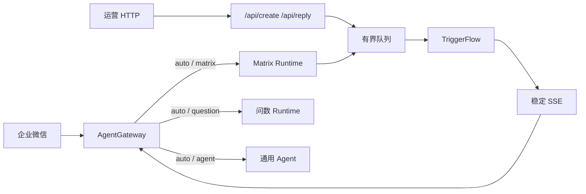

# MatrixCopilot 项目方案

社媒矩阵内容智能助手。本文是当前讨论的完整方案，作为产品、架构与工程落地的单一依据。

| 项 | 值 |
|---|---|
| 产品名 | MatrixCopilot |
| Runtime | `matrix` |
| 主路径 | 推文创作 `compose`、评论回复 `reply` |
| 参照工程 | 本仓库问数 Runtime（TriggerFlow、有界队列、SSE、证据短 key） |
| 文档日期 | 2026-08-15 |
| P0 终态 | 带评理与降级轨迹的草稿包，不发送 |

配套可视化：

- 架构总图：Cursor Canvas `matrix-architecture.canvas.tsx`
- 工程图：`matrix-engineering-diagram.canvas.tsx`
- 演示案例：`data/matrix/cases/x-twitter.json`

---

## 1. 目标与边界

### 1.1 要解决的问题

品牌在多个社媒账号上持续发帖、回评。痛点不是「再调一次大模型」，而是：

- 同一主题要适配多个平台形态，口径还得一致。
- 评论要先判断该不该回，再写，并且说得清为什么。
- 广告法、平台规则、违禁表述不能事后另开合规产品，必须卡在生成过程里。
- 对外承诺必须有可核验依据；没依据就不能装成已合规。

### 1.2 一句话设计

MatrixCopilot 把创作单或回复单编译成**带证据、带评理、过硬门降级**的草稿包。合规不是第三场景，而是贯穿 Brief / Draft / Review 的约束层。

### 1.3 做与不做

| 做 | 不做 |
|---|---|
| 推文/帖子多平台草稿 | 获客 CRM、线索跟进、群发 |
| 评论评理与回复草稿 | 把发帖做成 Agent 随手 tool |
| 硬规则 AC + 案例 RAG 证据 | 用检索召回代替违禁词拦截 |
| 有界任务、SSE、Gateway 路由 | P0 渠道发送、HITL 自动发 |
| 与问数并列的独立 Runtime | 通用 Copilot / 代码执行双引擎 |

---

## 2. 与现有工程的关系

本仓库已有统一 `AgentGateway`，以及 `agent` / `question` / `codex` 三个 Runtime。MatrixCopilot 作为第四个 Runtime 并列问数，不穿过通用 Agent 工具环。



对照问数的同构与必须改掉的点：

| 问数 | MatrixCopilot | 必须改掉 |
|---|---|---|
| rewrite → 子问题 | Brief → work_item | 项是平台稿或评论，不是指标 |
| catalog / snapshot | 品牌、平台、硬规则、评论卡片 | 目录不是表结构 |
| generate_sql + 预检 | Draft + ConstraintGate | 预检是字数/禁词/引用，不是 SQL |
| execute_sql | P0 不执行发送 | 发帖不可逆，不能对标只读查询 |
| evidence_id | ref_id / draft_key | 案例引用与降级轨迹 |
| final_answer | 草稿包 + 评理 | 不是图表经营结论 |

依赖方向与问数相同：分析包不依赖 HTTP、企业微信或 Gateway。`bootstrap` 只组装对象。

---

## 3. 产品场景

两个入口，一套 Flow，用 `scenario=compose|reply|auto` 分流。`auto` 由 Brief 做语义分类。

### 3.1 推文创作 compose

| 项 | 约定 |
|---|---|
| 入站 | `POST /api/create` 或 Gateway 文本 |
| 输入 | 主题、目标、`platform_keys[]`、`account_key` |
| 可选 | `need_trends=true` 时先抓取爆款，校验成 top-N 卡片再进 Brief |
| Brief | 共享 talking points，按平台拆 work_item |
| Draft | 每平台一条；评理与正文同请求 |
| Gate | 超限、禁词、未授权卖点 → 降级 |
| Review | 矩阵口径对齐；不能放宽 Gate |
| 产出 | `platform_key × draft`，带 rationale 与 degrade_trace |

### 3.2 评论回复 reply

| 项 | 约定 |
|---|---|
| 入站 | `POST /api/reply` |
| 输入 | 帖子快照 + offered comment 卡片；平台从线程继承 |
| 不用爆款 | 避免用热帖话术回具体用户 |
| Brief | 每条评论一个 work_item |
| Draft | 先裁 `reply / acknowledge / escalate / skip`，再写正文 |
| Gate | 攻击、诱导、未证事实、禁词 → skip 或 template；skip 正文必须空 |
| Review | 官方语气对齐；不得把 skip 抬回成可发回复 |
| 产出 | 评理 + 回复草稿；不回也要能看见原因 |

---

## 4. 总体架构

### 4.1 逻辑总图

```text
创作单 / 回复单
    → Gateway 或 HTTP 受理
    → 快照签发（硬规则 / 品牌 / 可选爆款 / 评论卡片）
    → Brief 拆 work_item
    → 案例 RAG 投影 ref_id
    → for_each Draft（评理 + 正文 + 引用）
    → ConstraintGate（AC + 校引用 + 降级）
    → Review（join 后收紧，不放宽）
    → 草稿包 SSE
```

约束层包住 Brief / RAG / Draft / Gate / Review：左侧把卡片注入每个 ModelRequest.info，右侧 Gate 是出门不变式。检索未命中不等于放行。

### 4.2 五类材料，五种接法

| 材料 | 形态 | 谁用 | 禁止 |
|---|---|---|---|
| 硬规则 | YAML/词表 + AC，`snapshot_id` | 两条路径的 .info 与 Gate | 进向量库、靠召回决定放行 |
| 品牌快照 | 人设、禁区、核准模板、`template_key` | 两条路径 | 用 Skill/关键词做意图路由 |
| 爆款 | 请求时抓取，元数据筛选 top-N 卡片 | 仅创作 | 向量化沉淀；直灌模型当已采用 |
| 评论线程 | 宿主签发 `comment_key` + 正文摘要 | 仅回复 | 模型抄平台 UID |
| 案例 RAG | Brief 之后按 work_item 检索，投影 `ref_id` | 两条路径的 draft.info | 替代 Gate；未命中视为已合规 |

### 4.3 进程切分

| 进程 | 职责 |
|---|---|
| `run_server.py` | 问数与 matrix 共用 HTTP；content 路由挂 `/api/create`、`/api/reply`、`/v1/matrix/tasks` |
| `run_im_assistant.py` | Gateway；`AUTO_RUNTIMES` 增加 matrix |

P0 不拆独立 `run_matrix.py`。附件仍钉 `agent`，Codex 仍须显式切换。

---

## 5. 规划拓扑

### 5.1 节点账本

| 节点 | 所有者 | 决策 | 拆开原因 |
|---|---|---|---|
| snapshot | 宿主 | 签发 brand / platform / policy / comment 短 key | 无快照不得开写 |
| fetch_trends | Action + 宿主校验 | 仅 compose 且 `need_trends` | 新观察，结果必须先成卡片 |
| brief | ModelRequest | scenario 与 work_items | 语义拆解；创作按平台、回复按评论 |
| retrieve_cases | Action + 宿主投影 | 检索案例，签发 offered refs | Brief 之后的新观察；空结果标 empty |
| draft[*] | ModelRequest | 评理、裁决、正文、claim_types、引用、proposed_degrade | 项间可并行；评理与正文同快照 |
| ConstraintGate | 宿主 | 执行降级，写 degrade_trace | Draft 之后的新观察，不能 instant 回灌 |
| review | ModelRequest | accept / revise；矩阵或语气对齐 | 必须看见全部兄弟项；不得撤销 skip/template |

Brief 不是入口表单。它是快照之后、检索与起草之前的那一次拆解请求。

### 5.2 边与失败

| 产物 | 消费者 | 缺失或触线 |
|---|---|---|
| 趋势卡片 | compose Brief | 抓取失败则无爆款继续写，limitation 记一笔 |
| work_items[*] | RAG 查询与 draft fan-out | 无工作项 → 任务 failed |
| offered refs | draft.info | empty 时该引则降级，禁止编法条 |
| rationale / decision | Gate 与运营 | 无评理不得出正文 |
| degrade_op | Review / TaskResult | 必须有；默认 skip |
| package | SSE / Gateway | 部分降级 → `partial`，不丢成功项 |

### 5.3 并发与压强

| 层 | 规则 |
|---|---|
| HTTP 受理 | 独立队列，容量 32，worker 4；满则 503 + Retry-After |
| work_item | `for_each(concurrency=4)` |
| 同一评论线程 | 可并行起草，join 后统一口径 |
| 发送 | P0 不存在；instant 不得触发副作用 |
| 修复 | 同一工作项最多 `rewrite_safe` 一次；三次同类失败则该项 failed |

### 5.4 Owner / Invariant

| Owner | 拥有 | 完成不变式 |
|---|---|---|
| AgentGateway | auto 增补 `matrix` | 模型只能返回已提供并校验的 runtime_key |
| Matrix HTTP | 任务受理、SSE、过载拒绝 | 受理任务最终 completed / partial / failed |
| MatrixTaskService | 有界队列与 Worker | 队列满立即拒绝 |
| Snapshot | 人设、平台、硬规则、评论投影 | 正文和评理只引用本次 snapshot_id |
| Brief | 工作项覆盖 | requirement 全覆盖；comment_key ∈ offered |
| RetrieveCases | 案例召回与 ref 投影 | 空结果必须显式 empty |
| Draft | 评理与正文 | skip ⇒ 空正文；evidence_id ∈ offered |
| ConstraintGate | AC、字数、引用、降级 | 硬策略失败不得进入 Review 的 accept 集合 |
| Review | 整包口径 | 只能改已有 draft_key；revise 再过 Gate |

---

## 6. 约束层

合规降级为贯穿生成的约束层，不做成独立模块，也不做成生成后的四层水槽。

### 6.1 所有权

| 类 | 所有者 | 例子 |
|---|---|---|
| 硬约束 | 宿主 | 违禁词、字数、PII、skip↔空正文、未知 key |
| 软约束 | 模型 | 卖点是否成立、该不该回、语气；只选 offered 枚举 |
| 降级 | 宿主算子 | 模型可提议 `degrade_to`，无效则按 Gate 结果 |
| 案例检索 | 证据，不放行 | 广告法/平台案例 → ref_id；缺证据则收紧 |

「生成即合规」不是不变式。注入只降低触线概率；正文离开系统前必须过 Gate。

### 6.2 降级阶梯

| 算子 | 含义 | 典型触发 |
|---|---|---|
| pass | 原文进入 Review | 未触线 |
| rewrite_safe | 按已声明 issues 再生成一次 | 超字数、可删卖点 |
| template_fallback | 换核准模板，保留评理 | 硬禁词、未授权功效/价格 |
| skip | 正文清空，rationale 保留 | 攻击、无关、无法核实 |
| escalate | P0 不做 | P2 人工 |

Review 只能收紧，不能把已 skip / template 抬回去。

---

## 7. RAG

RAG 是 Brief 之后的**案例检索节点**，不是约束层本体，也不检索违禁词。

```text
Brief.work_item
  → RetrieveCases
  → 宿主投影 offered ref_id
  → Draft.info
  → 正文 [[ref:e1]]
  → Gate 校引用
硬规则 AC ───────────────→ 同一 Gate（独立扫描）
```

### 7.1 库里记什么

每条记录是「凭什么能写这句」的有界事实：

- 广告法 / 平台案例：违规点、裁定要点、可否承诺
- 历史违规样本：问题句类型、处理结果（去个资）
- 核准口径：已批准的边界说法，不是整段话术模板

热侧卡片字段：`ref_id`、`platform_keys`、`claim_types`、`title`、`ruling`、`allowed`、`forbidden`、`quote`、`as_of`。`case_id` 与原文链接留冷侧。

### 7.2 不进 RAG

违禁词表、品牌人设 YAML、核准模板全文、实时爆款、评论原文、用户 UID。

### 7.3 数据从哪来

P0 使用设计夹具，例如 `data/matrix/cases/x-twitter.json`（12 条 Twitter/X 演示卡片）。它们对照公开规则主题写成，**不是** X 后台导出，不能当执法依据。

生产收录顺序：

1. X Rules / Ads policies 等官方页面，由合规摘裁定要点并标 `as_of`
2. 品牌自己的拒稿、限流、申诉记录（去个资）
3. 法务核定的广告法/行业禁承诺口径
4. 若开了广告投放，解析拒审回执

政策变更则新增记录、旧条过期，不在原 `ref_id` 上改语义。禁止爬取平台用户内容当语料，禁止模型编裁定。

### 7.4 空结果

显式标 `empty`。需要对外承诺却无 ref → `template` 或 `skip`，禁止编法条。未召回不得视为合规。

---

## 8. 契约

### 8.1 入站

| 字段 | 含义 |
|---|---|
| text | 创作主题或回复指令 |
| scenario | `compose` \| `reply` \| `auto` |
| platform_keys[] | 创作矩阵；回复可空，从 thread 继承 |
| account_key / brand_key | 矩阵账号人设 |
| need_trends | 仅 compose；true 才跑抓取 |
| thread_key / comments[] | 仅 reply |
| requester / channel | 审计，不进模型身份 |

Gateway 纯文本可用 `thread:demo-1` 加载样例线程。

### 8.2 TaskResult

- `status`：`completed` \| `partial`
- `task_type`：`compose_post` \| `reply_comment` \| `mixed`
- `summary`：运营可读整包摘要
- `drafts[]`：`draft_key`、`kind`、`decision`、`text`、`rationale`、`risk_flags`、`evidence_ids`、`degrade_op`、`status`
- `evidence[]`：本次 offered 卡片摘要
- `limitations[]`
- `snapshot_id` / `trace_ref`

### 8.3 HTTP 与 SSE

```text
POST /api/create
POST /api/reply
POST /v1/matrix/tasks
GET  /v1/matrix/tasks/{id}
GET  /v1/matrix/tasks/{id}/events
```

三个 POST 进入同一 TaskService。队列满返回 503。

SSE：`task.submitted`、`stage.*`、`work_item.ready`、`draft.ready`、一次 `package.ready`、`task.completed|failed`。Gateway 把 `package.ready` 译成一次 `message.delta`。

### 8.4 三条 ModelRequest

| 请求 | input | info | 必填输出 | 宿主验收 |
|---|---|---|---|---|
| brief | 用户原文、渠道 | offered 平台/评论卡片、品牌摘要、约束卡片 | normalized_brief、scenario、requirements、work_items | id 唯一；覆盖完整；key ∈ offered |
| draft | 单条 work_item、平台上限 | 人设、政策、offered refs | stance_assessment、reply_decision、draft_text、rationale、evidence_ids | 枚举合法；skip 空正文；引用合法 |
| review | brief + 已校验草稿 | 同一 snapshot | item_verdicts、package_summary、limitations | draft_key ∈ 已有；revise 再过 Gate |

禁止无注解的 `reasoning` / `thinking`。评理字段必须有消费者。

---

## 9. 工程规划

### 9.1 目录

```text
integrated_agent/runtimes/matrix/
  models.py
  service.py
  stores.py
  worker.py
  client.py
  analysis/
    snapshots.py
    constraints.py          # 硬规则、AC、降级
    retrieval.py            # RetrieveCases；P0 可返回 empty
    capability.py
    runner.py
    workflows/main_flow.py
    workflows/chunks/{brief,draft,review}.py
    prompts/{brief,draft,review}.yaml
integrated_agent/transports/http/matrix_api.py
integrated_agent/bootstrap/content_service.py   # 或 matrix_service.py
data/matrix/
  accounts.yaml
  platforms.yaml
  policy_terms.yaml
  templates.yaml
  sample_threads.json
  cases/x-twitter.json
```

改现有文件：`create_production_app` 挂路由；`AUTO_RUNTIMES` 与 intent instruct 增加 matrix；`im_assistant` 注册 Runtime；`ARCHITECTURE.md` / `README.md` 补账本。

不建：共享检索微服务、PolicyEngine、通用 TaskService。不让 `matrix` import `question.analysis`。YAML 人设不注册成 Skill 意图器。问数 stores 先复制，Result 同构再抽。

### 9.2 切片

| 切片 | 交付 | 验收 |
|---|---|---|
| S0 | models、硬规则、AC Gate、快照、案例夹具 | 未知 key fail-closed；skip 非空失败；X 案例可投影 |
| S1 | TriggerFlow + 可注入 runner | fan-out、partial、降级阶梯、空 RAG 收紧 |
| S2 | 双 API + 队列 + SSE | 202 / 503；package.ready 一次 |
| S3 | Gateway auto | offered 含 matrix；附件仍钉 agent |
| S4 | 填 Prompt，最小真模型冒烟 | 看 trace，不用关键词判分 |

S0→S3 串行合入；S4 可与 S2/S3 并行。P0 的 RetrieveCases 可以先返回 empty，但节点必须在。

### 9.3 测试

确定性测试先绿：validators、Brief schema、Flow 脚本化模型、HTTP/SSE、Gateway offered 集合。

模型质量（S4）最少两例：

1. 写帖：X 平台预热，1+ 条不超限草稿，禁词被 Gate 降级。
2. 评理：3 条评论含 1 条攻击，至少 1 条 skip 且正文为空。

---

## 10. 分期

| 期次 | 范围 | 验收 |
|---|---|---|
| P0 | 两场景 + 硬门 + 品牌快照 + 案例夹具 + SSE + Gateway | 一题两平台出矩阵稿；线程含 skip；词表禁词即使「没被检索到」也被 AC 拦住；不发送 |
| P1 | 真实抓取 Action、模板库、案例检索（只作 evidence） | 抓取后先出卡片再 Brief；检索未命中不放宽硬门；template 只许 offered key |
| P2 | HITL + 渠道发送 | 发送在 Gate 与审批之后；Flow 不直接打平台 API |

### 验收反例（必须挡住）

- 违禁词不在 RAG 命中里 → AC 仍拦截并降级
- 创作不加载品牌快照 → 不得开写
- 回复引用热帖话术库 → P0 不提供趋势卡片
- Review 把 skip 改回可发正文 → 宿主拒绝
- `/api/create` 与 `/api/reply` 各跑一套拓扑 → 同一 execution 契约
- 用关键词判断该不该回 → 评理归模型

---

## 11. 风险

| 风险 | 缓解 |
|---|---|
| 演示案例被当成现行法 | 夹具带 disclaimer；生产只收官方摘录与内部拒稿 |
| Gateway 文本带不上 thread_key | P0 允许 `thread:demo-1` |
| auto 把写帖误送到 agent | intent 卡片写清；可 `/agent matrix` |
| Review 改写后又超限 | revise 后强制再跑 Gate，失败则保留已通过原文 |
| 以后把 RAG 焊进 Gate | P0 先占 RetrieveCases 节点，空结果走 empty 契约 |
| 复制问数壳导致双份缺陷 | 只复制 service/stores；分析包重写，不抄 SQL 补丁 |

---

## 12. 结论

MatrixCopilot 是问数同构的内容 Runtime，不是获客系统，也不是通用 Copilot。

- 主路径只有创作和回复。
- Brief 负责拆工作项，不是第二种用户输入。
- 约束是注入 + Gate 降级，不是四层事后过滤。
- RAG 只提供可引用案例；硬门完备且不检索。
- P0 交付可审草稿包；发送留在 P2，且不得写进 Draft 节点。
