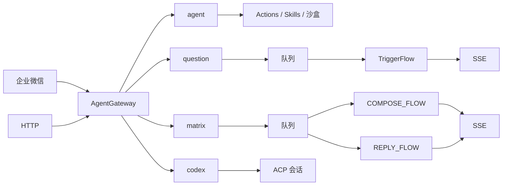

# MatrixCopilot 项目方案

社媒矩阵内容智能助手。本文是当前讨论的完整方案，作为产品、架构与工程落地的单一依据。

| 项 | 值 |
|---|---|
| 产品名 | MatrixCopilot |
| Runtime | `matrix` |
| 主路径 | 推文创作 `compose`、评论回复 `reply`（两套 Flow） |
| 参照工程 | 本仓库问数 Runtime（TriggerFlow、有界队列、SSE、证据短 key） |
| 文档日期 | 2026-08-15 |
| P0 终态 | 带评理与降级轨迹的草稿包，不发送 |

配套可视化：

- 架构总图：Cursor Canvas `matrix-architecture.canvas.tsx`
- 工程图：`matrix-engineering-diagram.canvas.tsx`
- 演示案例：`data/matrix/cases/x-twitter.json`
- 知识库切分：[MatrixCopilot-知识库切分策略.md](./MatrixCopilot-知识库切分策略.md)
- 知识库制品 CRUD / RecordStore：[MatrixCopilot-知识库制品管理.md](./MatrixCopilot-知识库制品管理.md)
- 知识库 RAG 计划表：[MatrixCopilot-RAG计划.md](./MatrixCopilot-RAG计划.md)

---

## 1. 目标与边界

### 1.1 要解决的问题

品牌在多个社媒账号上持续发帖、回评。痛点不是「再调一次大模型」，而是：

- 同一主题要适配多个平台形态，口径还得一致。
- 评论要先判断该不该回，再写，并且说得清为什么。
- 广告法、平台规则、违禁表述不能事后另开合规产品，必须卡在生成过程里。
- 对外承诺必须有可核验依据；没依据就不能装成已合规。

### 1.2 一句话设计

MatrixCopilot 把创作单或回复单编译成**带证据、带评理、过硬门降级**的草稿包。创作与回复是两套 Flow。合规不是第三场景，而是贯穿各自 Brief / Draft / Review 的约束层。

### 1.3 做与不做

| 做 | 不做 |
|---|---|
| 推文/帖子多平台草稿 | 获客 CRM、线索跟进、群发 |
| 评论评理与回复草稿 | 把发帖做成 Agent 随手 tool |
| 硬规则 AC + 案例 RAG 证据 | 用检索召回代替违禁词拦截 |
| 有界任务、SSE、Gateway 路由 | 渠道发送、人工审批 / HITL |
| 与问数并列的独立 Runtime | 通用 Copilot / 代码执行双引擎 |

---

## 2. 与现有工程的关系

本仓库已有统一 `AgentGateway`，以及 `agent` / `question` / `codex` 三个 Runtime。MatrixCopilot 作为第四个 Runtime 并列问数，不穿过通用 Agent 工具环。



两条并列入站，都先到 `AgentGateway`，再转发 Runtime。HTTP 的 `/api/create`、`/api/reply`、`/v1/tasks` 是 Transport 适配，不是绕过路由层的第二执行入口。matrix 入口绑定 `COMPOSE_FLOW` 或 `REPLY_FLOW`；`codex` 须显式切换；附件仍钉 `agent`。

对照问数的同构与必须改掉的点：

| 问数 | MatrixCopilot | 必须改掉 |
|---|---|---|
| rewrite → 子问题 | ComposeBrief / ReplyBrief → work_item | 项是平台稿或评论，不是指标；两套拆单 |
| catalog / snapshot | 品牌、平台、硬规则、评论卡片 | 目录不是表结构 |
| generate_sql + 预检 | Draft + ConstraintGate | 预检是字数/禁词/引用，不是 SQL |
| execute_sql | P0 不执行发送 | 发帖不可逆，不能对标只读查询 |
| evidence_id | ref_id / draft_key | 案例引用与降级轨迹 |
| final_answer | 草稿包 + 评理 | 不是图表经营结论 |

依赖方向与问数相同：分析包不依赖 HTTP、企业微信或 Gateway。`bootstrap` 只组装对象。

---

## 3. 产品场景

两个入口，两套 Flow。企业微信与 HTTP 都先经 `AgentGateway` 转发，不直连 TaskService。

| 入口 | 路由层写入 | 绑定 |
|---|---|---|
| HTTP `POST /api/create` | `runtime=matrix`，`scenario=compose` | `COMPOSE_FLOW` |
| HTTP `POST /api/reply` | `runtime=matrix`，`scenario=reply`；无 `comments` 则把 `text` 签发为一条评论 | `REPLY_FLOW` |
| HTTP `POST /v1/matrix/tasks` | `runtime=matrix`；`scenario` 须 compose/reply，否则 422 | 对应 Flow |
| HTTP `POST /v1/tasks` | `runtime=question` | 问数 Flow |
| 企业微信文本 | auto 选 runtime；落到 matrix 则 `scenario=compose` | `COMPOSE_FLOW` 或其它 Runtime |

禁止：HTTP 绕过 Gateway 直打队列；一张 TriggerFlow 用 `scenario` 开关；由 Brief 做 `compose|reply|auto` 分类；一单 `mixed`。Gateway 的 runtime `auto`（选 matrix / question / agent）仍在。

### 3.1 推文创作 compose

| 项 | 约定 |
|---|---|
| 入站 | HTTP `/api/create` 或企业微信文本落到 matrix；皆经 Gateway |
| 输入 | 主题、目标、`platform_keys[]`、`account_key` |
| 可选 | `need_trends=true` 时先抓取爆款，校验成 top-N 卡片再进 ComposeBrief |
| Brief | 共享 talking points，按平台拆 work_item |
| Draft | 每平台一条；评理与正文同请求；无 `reply_decision` |
| Gate | 超限、禁词、未授权卖点 → 降级 |
| Review | 矩阵口径对齐；不能放宽 Gate |
| 产出 | `platform_key × draft`，带 rationale 与 degrade_trace |

### 3.2 评论回复 reply

| 项 | 约定 |
|---|---|
| 入站 | HTTP `/api/reply`；Web 贴评或 `comments[]` |
| 输入 | offered comment 卡片；平台固定 `x-twitter` |
| 不用爆款 | 流程里没有 `fetch_trends` 节点 |
| Brief | 每条评论一个 work_item |
| Draft | 先裁 `reply / acknowledge / skip`，再写正文 |
| Gate | 攻击、诱导、未证事实、禁词 → skip 或 template；skip 正文必须空 |
| Review | 官方语气对齐；不得把 skip 抬回成可发回复 |
| 产出 | 评理 + 回复草稿；不回也要能看见原因 |

---

## 4. 总体架构

### 4.1 逻辑总图

```text
COMPOSE_FLOW
    → 快照（硬规则 / 品牌 / 平台）
    → 可选 fetch_trends → 爆款卡片
    → ComposeBrief 按平台拆
    → RetrieveCases 投影 ref_id
    → for_each ComposeDraft
    → ConstraintGate
    → ComposeReview（矩阵口径，不放宽 Gate）
    → 草稿包 SSE

REPLY_FLOW
    → 快照（硬规则 / 品牌 / 评论卡片）
    → ReplyBrief 按评论拆
    → RetrieveCases 投影 ref_id
    → for_each ReplyDraft（先裁再写）
    → ConstraintGate
    → ReplyReview（语气对齐，不得回抬 skip）
    → 草稿包 SSE
```

两套 Flow 共用 TaskService、SSE、ConstraintGate、RetrieveCases。图不同、Prompt 不同。REPLY_FLOW 没有趋势工位。约束层仍包住各自 Brief / RAG / Draft / Gate / Review。检索未命中不等于放行。

### 4.2 五类材料，五种接法

| 材料 | 形态 | 谁用 | 禁止 |
|---|---|---|---|
| 硬规则 | YAML/词表 + AC，`snapshot_id` | 两条路径的 .info 与 Gate | 进向量库、靠召回决定放行 |
| 品牌快照 | 人设、禁区、核准模板、`template_key` | 两条路径 | 用 Skill/关键词做意图路由 |
| 爆款 | 请求时抓取，元数据筛选 top-N 卡片 | 仅创作 | 向量化沉淀；直灌模型当已采用 |
| 评论线程 | 宿主签发 `comment_key` + 正文摘要 | 仅回复 | 模型抄平台 UID |
| 案例 RAG | Brief 之后按 work_item 检索，投影 `ref_id` | 两条路径的 draft.info | 替代 Gate；未命中视为已合规 |

### 4.3 进程切分

| 进程 | 职责 |
|---|---|
| `run_im_assistant.py` | WeCom / HTTP Transport → `AgentGateway`；`AUTO_RUNTIMES` 增加 matrix |
| `run_server.py` | 问数与 matrix 的 TaskService（队列 + Flow）；仅供 Runtime 内部调用 |

P0 不拆独立 `run_matrix.py`。客户端不直连 TaskService。附件仍钉 `agent`，Codex 仍须显式切换。

---

## 5. 规划拓扑

### 5.1 节点账本

4.1 画的是工位顺序。本表给每个工位建档：谁做、只准决定什么、为什么不能并进上一站。实现 TriggerFlow 时，每一行对应一个节点或 Chunk，不能少并、不能随便合并。

出现「新观察」（抓完热帖、检索完案例、扫完禁词）后，后面的模型必须看见已校验结果，不能还在同一次生成里猜。

| 列 | 在问什么 |
|---|---|
| 节点 | 流水线上这一站的名字 |
| 所有者 | 谁有权改这里的结果：宿主代码，或一次 ModelRequest |
| 决策 | 这一站只准决定什么 |
| 拆开原因 | 为什么不能并进上一站 |

| 节点 | 所有者 | 决策 | 拆开原因 |
|---|---|---|---|
| snapshot | 宿主 | 签发 brand / platform / policy / comment 短 key | 无快照不得开写 |
| fetch_trends | Action + 宿主校验 | 仅 `COMPOSE_FLOW` 且 `need_trends` | 新观察，结果必须先成卡片 |
| compose_brief / reply_brief | ModelRequest | 按平台或按评论拆 work_items | 入口已绑定场景；Brief 不分类 |
| retrieve_cases | Action + 宿主投影 | 检索案例，签发 offered refs | 各自 Brief 之后的新观察；空结果标 empty |
| compose_draft[*] / reply_draft[*] | ModelRequest | 评理、正文、引用；回复另裁 decision | 项间可并行；skip ⇒ 空正文 |
| ConstraintGate | 宿主 | 执行降级，写 degrade_trace | Draft 之后的新观察，不能 instant 回灌 |
| compose_review / reply_review | ModelRequest | accept / revise；矩阵或语气对齐 | 必须看见全部兄弟项；不得撤销 skip/template |

Brief 不是入口表单，也不做场景分类。它是本套 Flow 里、快照之后、检索与起草之前的那一次拆解请求。

典型拆开：

- Brief 与 Draft：前者只决定写给谁，后者才写句子；并在一次请求里，检索 query 仍是错的。
- RetrieveCases 不并进 Brief：没 work_item 就没有按平台/卖点的查询。
- Gate 不并进 Draft：正文是写完才有的对象，禁词必须由宿主事后扫描，不能 instant 回灌同一轮。

所有者划界：snapshot / Gate 是宿主（确定性）；Brief / Draft / Review 是模型（语义）。该不该回归 Draft，禁词拦不拦归 Gate。

与前后节：4.1 是顺序；5.1 是职责和拆分理由；5.2 是某一站没产出时怎么办；5.4 是做完算不算合格。

#### 签发短 key

开写前，宿主把本单能用的对象收成一份快照，给每个对象发一张短通行证。模型只能出示这些 key，不能编 ID，不能抄平台 UID 或整份 YAML。缺 brand 或 policy → 任务 failed。

| 短 key | 指向 | 模型可见 | 不可见 |
|---|---|---|---|
| `brand_key` | 人设 / 禁区 / 核准模板 | 人设摘要、`template_key` | 整份品牌 YAML |
| `platform_key` | 哪个平台 | 字数上限、提及规则 | 平台原始 frame |
| policy（`term_list_id`，随 `snapshot_id`） | 哪一版词表 + AC | 硬规则已就绪 | 词表全文（执法在 Gate） |
| `comment_key`（如 `c1`） | 回哪条评论 | 正文摘要、展示名 | 用户 UID |

总票根是 `snapshot_id`（内容哈希前 16 位）。正文和评理必须引用本次快照。Brief 验收：`platform_key` / `comment_key` ∈ offered，未知 key fail-closed。案例 `ref_id` 同此接法，但是 Brief 之后由 RetrieveCases 签发。

创作签发 brand、platform、policy；回复签发 brand、policy、comment，平台从线程继承。

### 5.2 边与失败

| 产物 | 消费者 | 缺失或触线 |
|---|---|---|
| 趋势卡片 | compose Brief | 抓取失败则无爆款继续写，limitation 记一笔 |
| work_items[*] | RAG 查询与 draft fan-out | 无工作项 → 任务 failed |
| offered refs | draft.info | empty 时该引则降级，禁止编法条 |
| rationale / decision | Gate 与运营 | 无评理不得出正文 |
| degrade_op | Review / TaskResult | 必须有；默认 skip |
| package | SSE / Gateway | 部分降级 → `partial`，不丢成功项 |

### 5.3 并发与压强

| 层 | 规则 |
|---|---|
| HTTP 受理 | 独立队列，容量 32，worker 4；满则 503 + Retry-After |
| work_item | `for_each(concurrency=4)` |
| 同一评论线程 | 可并行起草，join 后统一口径 |
| 发送 | P0 不存在；instant 不得触发副作用 |
| 修复 | 同一工作项最多 `rewrite_safe` 一次；三次同类失败则该项 failed |

### 5.4 Owner / Invariant

权责表，不是第二张流程图。Owner 是「这件事归谁管」；完成不变式是「做完时必须成立，否则不能往下」。例如 Draft：`skip` 则正文为空，`evidence_id` ∈ offered。AgentGateway：模型只能返回已校验的 `runtime_key`，客户端不直连队列。

| Owner | 拥有 | 完成不变式 |
|---|---|---|
| AgentGateway | 企业微信与 HTTP 的 Runtime 转发；auto 含 matrix | 模型只能返回已提供并校验的 runtime_key；客户端不直连 TaskService |
| HTTP / WeCom Transport | 归一成 GatewayRequest | 不选 Flow、不入队 |
| MatrixTaskService | 有界队列与 Worker | 队列满立即拒绝 |
| Snapshot | 人设、平台、硬规则、评论投影 | 正文和评理只引用本次 snapshot_id |
| ComposeBrief / ReplyBrief | 本套 Flow 的工作项覆盖 | requirement 全覆盖；reply 的 comment_key ∈ offered |
| RetrieveCases | 案例召回与 ref 投影 | 空结果必须显式 empty |
| Draft | 评理与正文 | skip ⇒ 空正文；evidence_id ∈ offered |
| ConstraintGate | AC、字数、引用、降级 | 硬策略失败不得进入 Review 的 accept 集合 |
| Review | 整包口径 | 只能改已有 draft_key；revise 再过 Gate |

---

## 6. 约束层

合规降级为贯穿生成的约束层，不做成独立模块，也不做成生成后的四层水槽。

### 6.1 所有权

| 类 | 所有者 | 例子 |
|---|---|---|
| 硬约束 | 宿主 | 违禁词、字数、PII、skip↔空正文、未知 key |
| 软约束 | 模型 | 卖点是否成立、该不该回、语气；只选 offered 枚举 |
| 降级 | 宿主算子 | 模型可提议 `degrade_to`，无效则按 Gate 结果 |
| 案例检索 | 证据，不放行 | 广告法/平台案例 → ref_id；缺证据则收紧 |

「生成即合规」不是不变式。注入只降低触线概率；正文离开系统前必须过 Gate。

### 6.2 降级阶梯

| 算子 | 含义 | 典型触发 |
|---|---|---|
| pass | 原文进入 Review | 未触线 |
| rewrite_safe | 按已声明 issues 再生成一次 | 超字数、可删卖点 |
| template_fallback | 换核准模板，保留评理 | 硬禁词、未授权功效/价格 |
| skip | 正文清空，rationale 保留 | 攻击、无关、无法核实 |

Review 只能收紧，不能把已 skip / template 抬回去。不做人工审批；模型若提议 `escalate`，Gate 映射为 `skip`。

---

## 7. RAG

RAG 夹在 Brief 拆完 work_item 之后、Draft 开写之前。作用是给这一条稿提供可引用的案例证据（「凭什么能写这句」），不是合规放行，也不是禁词扫描。

必须先拆项再检索：创作按平台搜、回复按评论搜。硬规则 AC 与 RAG 在同一 Gate 汇合，但是两条独立的线。

```text
Brief.work_item
  → RetrieveCases
  → 宿主投影 offered ref_id
  → Draft.info
  → 正文 [[ref:e1]]
  → Gate 校引用
硬规则 AC ───────────────→ 同一 Gate（独立扫描）
```

### 7.1 库里记什么

每条记录是「凭什么能写这句」的有界事实：

- 广告法 / 平台案例：违规点、裁定要点、可否承诺
- 历史违规样本：问题句类型、处理结果（去个资）
- 核准口径：已批准的边界说法，不是整段话术模板

热侧卡片字段：`ref_id`、`platform_keys`、`claim_types`、`title`、`ruling`、`allowed`、`forbidden`、`quote`、`as_of`。`case_id` 与原文链接留冷侧。

### 7.2 不进 RAG

违禁词表、品牌人设 YAML、核准模板全文、实时爆款、评论原文、用户 UID、私有知识库块（另库，见 [知识库制品管理](./MatrixCopilot-知识库制品管理.md)）。

### 7.3 数据从哪来

P0 使用设计夹具，例如 `data/matrix/cases/x-twitter.json`（12 条 Twitter/X 演示卡片）。它们对照公开规则主题写成，**不是** X 后台导出，不能当执法依据。

生产收录顺序：

1. X Rules / Ads policies 等官方页面，由合规摘裁定要点并标 `as_of`
2. 品牌自己的拒稿、限流、申诉记录（去个资）
3. 法务核定的广告法/行业禁承诺口径
4. 若开了广告投放，解析拒审回执

政策变更则新增记录、旧条过期，不在原 `ref_id` 上改语义。禁止爬取平台用户内容当语料，禁止模型编裁定。

### 7.4 空结果

显式标 `empty`。需要对外承诺却无 ref → `template` 或 `skip`，禁止编法条。未召回不得视为合规。

---

## 8. 契约

### 8.1 入站

| 字段 | 含义 |
|---|---|
| text | 创作主题；回复有 comments 时是运营指令，否则签发为待回评论 |
| scenario | `compose` \| `reply`；入口已绑定则由宿主写入，禁止 `auto` |
| platform_keys[] | 创作矩阵；回复可空，平台固定 `x-twitter` |
| account_key / brand_key | 矩阵账号人设 |
| need_trends | 仅 compose；true 才跑抓取。reply 请求携带则忽略 |
| comments[] | 仅 reply；compose 请求携带则 422。省略则用 text 签发一条评论 |
| requester / channel | 审计，不进模型身份 |

Gateway 纯文本落到 matrix 时绑定 `COMPOSE_FLOW`。回评走 HTTP `comments[]`。

### 8.2 TaskResult

- `status`：`completed` \| `partial`
- `task_type`：`compose_post` \| `reply_comment`（由所跑 Flow 决定，禁止 `mixed`）
- `summary`：运营可读整包摘要
- `drafts[]`：`draft_key`、`kind`、`decision`、`text`、`rationale`、`risk_flags`、`evidence_ids`、`degrade_op`、`status`
- `evidence[]`：本次 offered 卡片摘要
- `limitations[]`
- `snapshot_id` / `trace_ref`

### 8.3 HTTP 与 SSE

```text
POST /api/create
POST /api/reply
POST /v1/matrix/tasks
GET  /v1/matrix/tasks/{id}
GET  /v1/matrix/tasks/{id}/events
```

三个 POST 是 HTTP Transport 路径，先入 `AgentGateway` 再转发 Runtime。队列满返回 503。`/v1/matrix/tasks` 的 `scenario` 必须是 `compose` 或 `reply`。TaskService 的内部受理接口不对客户端直出。

SSE：`task.submitted`、`stage.*`、`work_item.ready`、`draft.ready`、一次 `package.ready`、`task.completed|failed`。Gateway 把 `package.ready` 译成一次 `message.delta`。

### 8.4 六条 ModelRequest

两套 Flow 各三条，契约不共用。禁止一个 Brief schema 用 `scenario` 兼做分类器。

**COMPOSE_FLOW**

| 请求 | input | info | 必填输出 | 宿主验收 |
|---|---|---|---|---|
| compose_brief | 用户原文、渠道 | offered 平台卡片、品牌摘要、约束卡片、可选趋势卡片 | normalized_brief、requirements、work_items | id 唯一；覆盖完整；`platform_key` ∈ offered |
| compose_draft | 单条 work_item、平台上限 | 人设、政策、offered refs | stance_assessment、draft_text、rationale、evidence_ids | 引用合法；不得输出 `reply_decision` |
| compose_review | brief + 已校验草稿 | 同一 snapshot | item_verdicts、package_summary、limitations | draft_key ∈ 已有；revise 再过 Gate |

**REPLY_FLOW**

| 请求 | input | info | 必填输出 | 宿主验收 |
|---|---|---|---|---|
| reply_brief | 用户原文、渠道 | offered 评论卡片、品牌摘要、约束卡片 | normalized_brief、requirements、work_items | id 唯一；覆盖完整；`comment_key` ∈ offered |
| reply_draft | 单条 work_item、平台上限 | 人设、政策、offered refs | stance_assessment、reply_decision、draft_text、rationale、evidence_ids | 枚举合法；skip 空正文；引用合法 |
| reply_review | brief + 已校验草稿 | 同一 snapshot | item_verdicts、package_summary、limitations | draft_key ∈ 已有；不得把 skip 改回可发 |

禁止无注解的 `reasoning` / `thinking`。评理字段必须有消费者。

---

## 9. 工程规划

### 9.1 目录

```text
integrated_agent/runtimes/matrix/
  models.py
  service.py
  stores.py
  worker.py
  client.py
  analysis/
    snapshots.py
    constraints.py          # 硬规则、AC、降级
    retrieval.py            # RetrieveCases；P0 可返回 empty
    capability.py
    runner.py
    workflows/compose_flow.py
    workflows/reply_flow.py
    workflows/chunks/compose/{brief,draft,review}.py
    workflows/chunks/reply/{brief,draft,review}.py
    prompts/compose/{brief,draft,review}.yaml
    prompts/reply/{brief,draft,review}.yaml
integrated_agent/transports/http/matrix_api.py
integrated_agent/bootstrap/content_service.py   # 或 matrix_service.py
data/matrix/
  accounts.yaml
  platforms.yaml
  policy_terms.yaml
  templates.yaml
  cases/x-twitter.json
```

改现有文件：`create_production_app` 挂路由；`AUTO_RUNTIMES` 与 intent instruct 增加 matrix；`im_assistant` 注册 Runtime；`README.md` 补账本。

不建：共享检索微服务、PolicyEngine、通用 TaskService。不让 `matrix` import `question.analysis`。YAML 人设不注册成 Skill 意图器。问数 stores 先复制，Result 同构再抽。

### 9.2 切片

| 切片 | 交付 | 验收 |
|---|---|---|
| S0 | models、硬规则、AC Gate、快照、案例夹具 | 未知 key fail-closed；skip 非空失败；X 案例可投影 |
| S1 | 两套 TriggerFlow + 可注入 runner | 入口绑定拓扑；compose 无评论节点；reply 无 trends |
| S2 | 双 API + 队列 + SSE | 202 / 503；package.ready 一次 |
| S3 | Gateway auto | offered 含 matrix；附件仍钉 agent |
| S4 | 填 Prompt，最小真模型冒烟 | 看 trace，不用关键词判分 |

S0→S3 串行合入；S4 可与 S2/S3 并行。P0 的 RetrieveCases 可以先返回 empty，但节点必须在。

### 9.3 测试

确定性测试先绿：validators、两套 Brief schema、两套 Flow 脚本化模型、HTTP/SSE、Gateway offered 集合。`/v1/matrix/tasks` 传 `auto` 必须 422。

模型质量（S4）最少两例：

1. 写帖：X 平台预热，1+ 条不超限草稿，禁词被 Gate 降级。
2. 评理：3 条评论含 1 条攻击，至少 1 条 skip 且正文为空。

---

## 10. 分期

| 期次 | 范围 | 验收 |
|---|---|---|
| P0 | 两场景 + 硬门 + 品牌快照 + 案例夹具 + SSE + Gateway | 一题两平台出矩阵稿；线程含 skip；词表禁词即使「没被检索到」也被 AC 拦住；不发送 |
| P1 | 真实抓取 Action、模板库、案例检索（只作 evidence） | 抓取后先出卡片再 Brief；检索未命中不放宽硬门；template 只许 offered key |
| P2 | 渠道发送 | 发送在 Gate 之后；无人工审批；Flow 不直接打平台 API |

### 验收反例（必须挡住）

- 违禁词不在 RAG 命中里 → AC 仍拦截并降级
- 创作不加载品牌快照 → 不得开写
- 回复引用热帖话术库 → P0 不提供趋势卡片
- Review 把 skip 改回可发正文 → 宿主拒绝
- 两套 Flow 焊回一张图、靠 Brief 的 `scenario` / `auto` 分类 → 禁止
- 一单产出 `mixed` → 禁止
- 用关键词判断该不该回 → 评理归模型

---

## 11. 风险

| 风险 | 缓解 |
|---|---|
| 演示案例被当成现行法 | 夹具带 disclaimer；生产只收官方摘录与内部拒稿 |
| Gateway 文本带不上结构化评论 | 回评走 HTTP `comments[]`；企业微信落到 matrix 时走创作 |
| auto 把写帖误送到 agent | intent 卡片写清；可 `/agent matrix` |
| Review 改写后又超限 | revise 后强制再跑 Gate，失败则保留已通过原文 |
| 以后把 RAG 焊进 Gate | P0 先占 RetrieveCases 节点，空结果走 empty 契约 |
| 复制问数壳导致双份缺陷 | 只复制 service/stores；分析包重写，不抄 SQL 补丁 |

---

## 12. 结论

MatrixCopilot 是问数同构的内容 Runtime，不是获客系统，也不是通用 Copilot。

- 主路径是两套 Flow：创作与回复。入口绑定拓扑，Brief 不分类。
- Brief 负责拆工作项，不是第二种用户输入，也不是场景路由器。
- 约束是注入 + Gate 降级，不是四层事后过滤。
- RAG 只提供可引用案例；硬门完备且不检索。
- P0 交付可审草稿包；发送留在 P2，无人工审批，且不得写进 Draft 节点。
